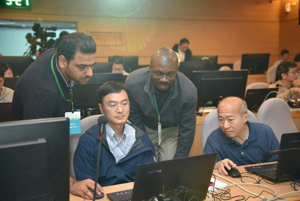

# Register Now for Microsoft 365 DevDays Beijing 2019!

 

<b>Register Now for
Microsoft 365 DevDays Beijing 2019!</b>

Microsoft is returning to Beijing this November for another
exciting DevDays event! Join us for two-days of hands-on technical sessions and
workshops, face-to-face meetings with Microsoft engineers, and new this year a
Microsoft Teams Hackathon! The multiday event will be packed with introductory
and deep-dive sessions covering topics across the Microsoft 365 and SQL Server
platforms and is free to attend.

Invite your friends and colleagues and join us November
15-17, 2019 at the Microsoft Beijing campus! Share your solutions, ideas, and
questions. Create a new project or enhance your existing one with our hands-on
labs and Microsoft Teams Hackathon! Get the latest developer information and
learn about our newest features, product updates, and protocol changes! We hope
to see you there! <a href="https://www.interopevents.com/beijing19">Register now!</a>

<b>What to look forward to:</b>

Enjoy a range of presentations, workshops, and highlights: 

<ul><li>
 
Building Applications with the Microsoft 365 Platform

</li><li>
 
Office Developer Platforms (Microsoft Graph, Office Add-ins,
Bots, and more) 

</li><li>
 
Development with Microsoft Teams

</li><li>
 
MS-WOPI and MS-FSSHTTP

</li><li>
 
SQL Platform Abstraction Layer

</li><li>
 
SQL Linux and Containers

</li><li>
 
SQL Server 2019 Protocols

</li><li>
 
Developer Platforms for Interoperability 

</li></ul>
<b>Event Details: </b>

<b>What:</b> Microsoft 365 DevDays Beijing 2019

<b>When:</b> November 15-17, 2019  

<b>Where:</b> Microsoft Beijing Campus, No. 5 Dan Ling
Street, Haidian District, Beijing 100080, China  

<b>Who:</b> Developers, Solution Providers, ISVs, IT Admins,
Enterprise Developers, and Students

<b>Cost:</b> FREE! 

<table>
 <thead>
  <tr>
   <th>
   

   </th>
   <th>
   

   </th>
  </tr>
 </thead>
</table>

 

Find more information <a href="https://interopevents.com/beijing19">here!</a>

Email interopdevevents@microsoft.com with questions and to
stay updated! 

Follow us on Twitter @InteropEvents 

                