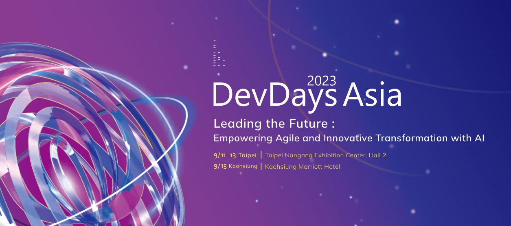

# Save the Date for DevDays Asia 2023 @Taipei!

 

<a href="https://interopevents.com/en-us/taipei2023">Register Now!</a>

We are excited to announce Microsoft DevDays Asia @ Taipei
2023! 

Join us in person September 11-13 for introductory and
deep-dive technical sessions covering the latest developer information, newest
features, product updates and protocol changes. There will be a wide range of
presentations and topics such as interoperability, Microsoft 365, security
&amp; compliance, Data &amp; AI, Azure and SQL Server platforms and much more!
Network with our expert engineers and share your ideas and solutions!

A separate one-day event will be held in Kaohsiung, Taiwan
on September 15.

For questions about this event please email <a href="mailto:devdaysasia@microsoft.com">devdaysasia@microsoft.com</a>

<b>Event Details:</b>

<b>What:</b> Microsoft DevDays Asia 2023 @ Taipei

<b>When:</b> Sept. 11-13 (UTC +8)

<b>Where:</b> In-person, Fubon International Conference
Center Taipei

<b>Who:</b> Developers, Solution Providers, ISVs, IT Admins,
Enterprise Developers and Students

<b>Cost:</b> Free!

Find more information <a href="https://interopevents.com/beijing19">here!</a>

Email <a href="mailto:interopdevevents@microsoft.com">interopdevevents@microsoft.com</a>
to stay updated!

                