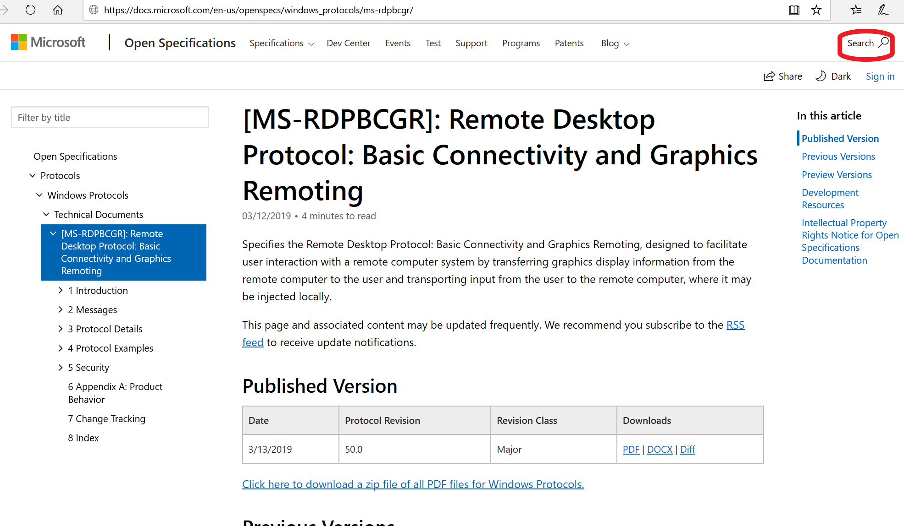
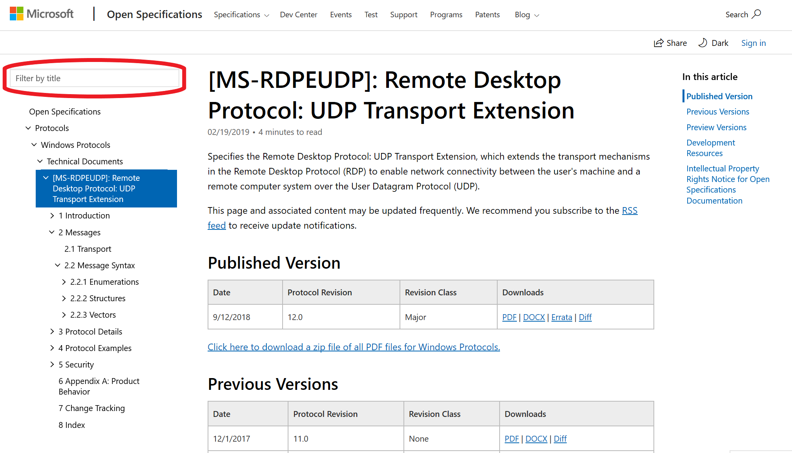
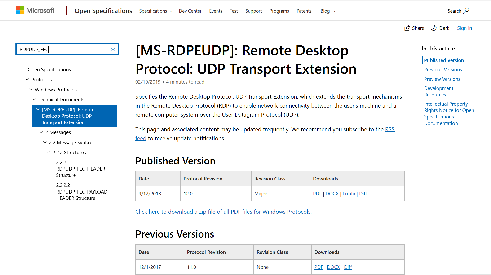
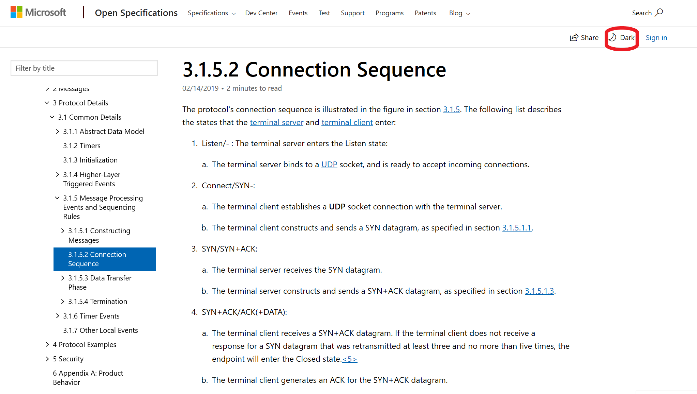

# 04/01 - Tips and Tricks for Using learn.microsoft.com (DMC)

 

The learn.microsoft.com (DMC) platform offers great new
features for the Open Specifications content, many of them detailed in <a href="https://learn.microsoft.com/teamblog/announcing-open-specifications-migration">this
blog post</a> we wrote when we launched last month.

Below are additional tips and tricks to help you make more
use of the new functionality.

<b>1. Using short URLs to find your documents</b>

To quickly navigate to a protocol document in any browser,
append its short name to this URL - <a href="https://learn.microsoft.com/openspecs/windows_protocols/">https://learn.microsoft.com/openspecs/windows_protocols/</a>.
For example, to quickly go to the MS-RDPBCGR document, enter <a href="https://learn.microsoft.com/openspecs/windows_protocols/MS-RDPBCGR">https://learn.microsoft.com/openspecs/windows_protocols/MS-RDPBCGR</a>
in your browser. 

<b>2. Using focused search to find specific content within
each document</b>

Click the top right-hand search tool to open the search
window shown below and enter the search term. 

Notice that the search URL - <a href="https://learn.microsoft.com/search/index?search=%22connection+sequence%22&amp;scope=OpenSpecs">https://learn.microsoft.com/search/index?search=%22connection+sequence%22&amp;scope=OpenSpecs</a>
- contains the tag scope=OpenSpecs which also appears in the search window.
This means that the search is scoped to the Open Specifications documents. To
search across all the documents on learn.microsoft.com, clear the OpenSpecs tag
from the search window or remove it from the URL. 

The results from the above search on the string “connection
sequence” are shown below.

To modify the scope, you can change the scope tag in the
URL. For example, to find related content in the Windows API reference docs,
change the tag value to Windows, i.e., <a href="https://learn.microsoft.com/search/index?search=%22connection+sequence%22&amp;scope=Windows">https://learn.microsoft.com/search/index?search=%22connection+sequence%22&amp;scope=Windows</a>.

Finally, you can subscribe to the RSS feed of your search
results so that you can be notified if content related to your search term is
added, changed or removed.

<b>3. Searching topic titles</b>

If you want to search through the topic titles to find
titles that include a particular text string, rather than scrolling through the
TOC, use the filtered search field located above the TOC as shown below.

The TOC displayed will change to show just the topics that
contain the search term in their titles.

Note that the filter title search is scoped to your location
in the TOC. In the above example, only the topic highlighted and the underlying
child topics, i.e., all the titles in the MS-RDPEUDAP book, will be searched.
To change the scope, move to another section of the TOC. For example, to search
all the Windows Protocol titles, move to the Windows Protocols node in the TOC
before doing your filtered title search.

Important: Do not use quotes (“”) in your filtered title
search.

<b>5. Changing the page display</b>

For low light situations, the default black text on white
display may not be the best option. To change the page to display light text on
a dark background, select the Dark icon as shown below.

Select the Light icon as shown below to change it back.

                
