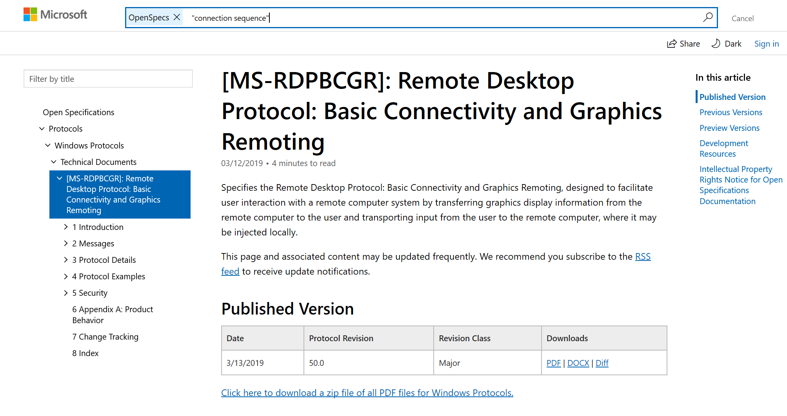
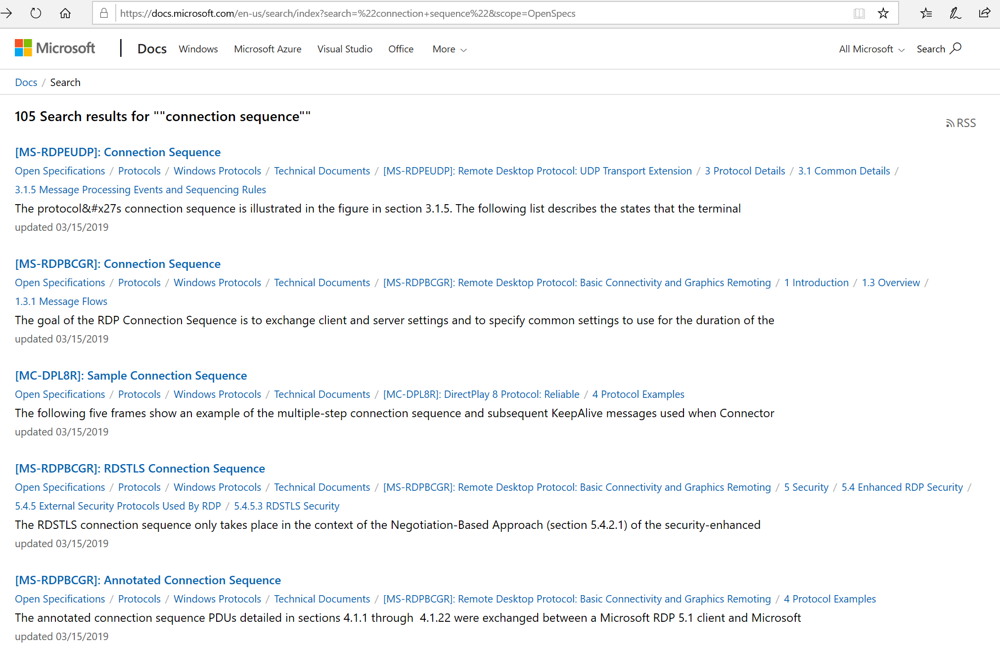

# Backup and Restore OPN Packages

 

The Microsoft Message Analyzer back-end Azure service aka
the <a href="http://go.microsoft.com/fwlink/?LinkId=401500">Asset Feed service</a>
provides the mechanism for the MMA client to update the OPN Parser packages and
the UI feature configuration (e.g. Filters, Color Rules, etc.). The MMA Azure
service will be removed on 11/25/2019. If you would like to save local versions
of the OPN parser packages for install after 11/25/2019, follow the guidance
below.

.

<b>Backup OPN parser packages and other asset files</b>

Before November 25 2019:

<ol><li>
    Install
Microsoft Message Analyzer from
https://www.microsoft.com/en-us/download/details.aspx?id=44226 if you have not
yet done so.

</li><li>
    Launch Microsoft
Message Analyzer, click the Tools menu and select Asset Manager, 

</li><li>
    Check that the
official Message Analyzer Feed(http://go.microsoft.com/fwlink/?LinkId=401500)
is subscribed, and the synchronizing state as indicated in the top right corner
of the Asset Manager window is Online.

</li></ol>

<ol start="4."><li>
    Switch to the
Downloads tab, click ‘Sync All Displayed Items’ button to start downloading the
latest OPN Parser packages from the official Asset Feed service.

</li><li>
    Once 
downloading is completed, you will see a message asking you to restart
Microsoft Message Analyzer.

</li></ol>

<ol start="6."><li>
    Close and
restart Microsoft Message Analyzer.

</li><li>
    Open Asset
Manager, go to the Setting tab and verify that the Core Networking Version
is.1.47. This is your confirmation that  the latest OPN Packages are installed.

</li></ol>

<ol start="8."><li>
    In Windows
Explorer, open path
C:\Users\&lt;user-name&gt;\AppData\Local\Microsoft\MessageAnalyzer. Backup the
Assets and OPNAndConfiguration folders to another location.

</li></ol>
<b>Important:</b> The MMA Azure (Asset Feed) service will be
removed and the ability to download parsers no longer available after
11/25/2019

<b>Restore OPN parser packages and other asset files</b>

After November 25 2019, follow the below guidance to restore
your backed-up OPN packages and other assets when doing a new installation of
Microsoft Message Analyzer.

<ol><li>
    Install
Microsoft Message Analyzer from your local backup.

</li><li>
    Launch Microsoft
Message Analyzer (to initialize the user folder).

</li><li>
    In Windows
Explorer, open path
C:\Users\&lt;user-name&gt;\AppData\Local\Microsoft\MessageAnalyzer, and replace
the Assets and OPNAndConfiguration folders with your backup copy.

</li><li>
    Re-launch
Microsoft Message Analyzer. Open Asset Manager to check that the OPN packages
are  the latest versions (the Core Networking Version should be 1.47).

</li></ol>
                