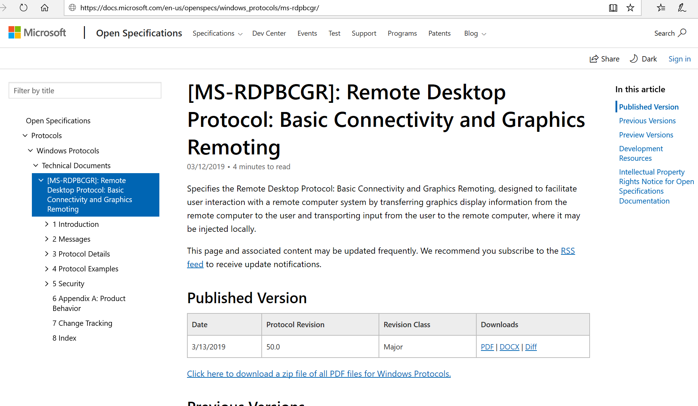

# Microsoft Message Analyzer Blog

 

All
things about Message Analyzer and related diagnosis for Networks Traces, Log
files, and Windows Event Tracing (ETW) Components. To view older blog posts, see <a href="https://web.archive.org/web/20190421060957/https://blogs.technet.microsoft.com/messageanalyzer/">here</a>. 

<b>Microsoft Message Analyzer – Final Deprecation Notice </b>

Microsoft Message Analyzer (MMA) will be retired and its
download packages removed from microsoft.com sites on <b>November 25 2019</b>. 
There is currently no Microsoft replacement for Microsoft Message Analyzer in
development at this time.  For similar functionality, please consider using a
3rd party network protocol analyzer tool such as WireShark. 

If you already have Microsoft Message Analyzer installed,
you may continue to use it, along with the OPN parsers you have already
downloaded. If you do want to continue using MMA, please make sure you have the
latest versions of MMA and OPN parsers installed (see the <b>Recommendations</b>
section below for download details).

<b>Versions Affected</b>

Versions 1.4 and earlier.

<b>Reason for Deprecation</b>

Microsoft Message Analyzer was last released in October 2016
and has not been under active development since that date. There are no plans
for further public releases of Microsoft Message Analyzer. 

<b>Impact</b>

If you already have Microsoft Message Analyzer installed,
you may continue to use it, along with the OPN parsers you have already
downloaded. However, after November 25 2019, no versions of Microsoft Message Analyzer
will be made available for public download on Microsoft.com sites and you will
no longer be able to download OPN parsers. 

<b>Recommendations</b>

If you don’t already have Microsoft Message Analyzer
installed, install it now before November 25 2019 from <a href="https://www.microsoft.com/en-us/download/details.aspx?id=44226">https://www.microsoft.com/en-us/download/details.aspx?id=44226</a>.

If you already have Microsoft Message Analyzer installed,
download the latest OPN parser packages before November 25 2019 by following
the steps at <a href="https://docs.microsoft.com/en-us/message-analyzer/managing-microsoft-opn-parser-packages">https://docs.microsoft.com/en-us/message-analyzer/managing-microsoft-opn-parser-packages</a>.

                