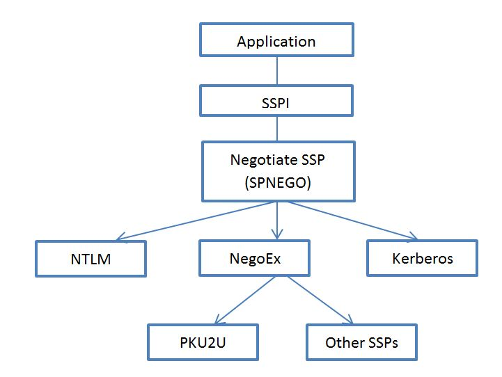

# A quick look at the new negotiation mechanism (NegoEx) used with SPNEGO in Windows 7

[Hongwei
Sun-MSFT](https://social.msdn.microsoft.com/profile/Hongwei%20Sun-MSFT)
6/30/2011 8:55:00
PM

-----

**What
is NegoEx ?  Why do we need it
?**

  
Before Windows 7 was introduced, applications utilize the SPNEGO to
provide the ability to negotiate the authentication support between
Kerberos SSP and NTLM SSP.  SPNEGO itself is also implemented as a
Negotiate SSP that only manages the selection of the authentication
packages based on the configurations of clients, servers and domain
controllers.    Even there are other security packages such as Digest
and  Schannel available, Negotiate SSP was implemented to support the
negotiation only between NTLM and Kerberos.  This makes it impossible
for the application that already uses the Negotiate SSP to use
additional authentication protocols.   In Windows 7,  NegoEx SSP is
introduced to allow for the creation and installation of new negotiable
security support packages without breaking down the existing SPNEGO
negotiation mechanism.    NegoEx is a protocol specified by
[draft-zhu-negoex](http://tools.ietf.org/html/draft-zhu-negoex-04).  
It is implemented as a new SSP.  The Negotiate SSP was modified to
support NegoEx SSP in addition to NTLM and Kerberos SSPs.   The  NegoEx
SSP in turn loads additional security packages.   During negotiation,
Negotiate SSP will call into NegoEx SSP to find if any of its installed
security package can supported the requested authentication.     Custom
SSP can be implemented and loaded into NegoEx SSP.  In Windows 7, PKU2U
is the only such a SSP loaded by default.  The following diagram can
show the relationship between all the SSPs and
SSPI.

**What
is PKU2U ? 
**

  
The PKU2U (Public Key Cryptography Based User-to-User) protocol in
Windows 7 and Windows Server 2008 R2 is implemented as a SSP that can be
loaded by NegoEx SSP. The SSP enables peer-to-peer authentication using
online ID, particularly through the Windows 7 media and file sharing
feature called Homegroup, which permits sharing between computers that
are not members of a domain.   Users have to set up online ID
integration in Windows 7 by explicitly linking their Windows user
account to an Online
ID.   The
more information about the PKU2U and Online ID can be
found:

  - [Draft-zhu-pku2u-09](http://tools.ietf.org/html/draft-zhu-pku2u-09)
  - [Introducing PKU2U in
    Windows](http://technet.microsoft.com/en-us/library/dd560634\(WS.10\).aspx)
  - [Introducing Online
    Identity
    Integration](http://blogs.msdn.com/tiny_mce/plugins/paste/•%09http:/technet.microsoft.com/en-us/library/dd560662\(WS.10\).aspx)
  - [Online Identity
    Integration in Windows
    7](http://technetnepal.net/blogs/gandip/archive/2010/03/02/online-identity-integration-in-windows-7.aspx)

**** 

**Network
Packets
Analysis:**

The
message exchanges of NegoEx are explained in details in 7.1 and 7.2 of 
draft-zhu-negoex-04.  The following are the security tokens in network
packets showing in a typical flow for the authentication used in SMB2. 
I will not repeat in details what have been explained in the
specification, but show what a normal Negoex SSP negotiation will look
like in a network
trace.

1. 
  The initial token from the acceptor contains meta data and the SSPs it
supports.  In this case, the Kerberos is not available since it is not
in a domain environment, so only NTLM and NegoEx SSP are available for
negotiation.   NegoEx will have the preference.

SMB2: R  
NEGOTIATE (0x0), GUID={3521747B-D33A-1DBB-468F-AB41EB2D075F}

-
securityBlob:   

    - GSSAPI:

     -
InitialContextToken: 

      +
ApplicationHeader: 

      +
ThisMech: SpnegoToken (1.3.6.1.5.5.2)

      -
InnerContextToken: 0x1

       -
SpnegoToken: 0x1

        +
ChoiceTag: 

        -
NegTokenInit: 

         +
SequenceHeader: 

         + Tag0:

         -
MechTypes: Prefer Negoex (1.3.6.1.4.1.311.2.2.30)

             +
SequenceHeader: 

             +
MechType: Negoex (1.3.6.1.4.1.311.2.2.30)

             +
MechType: NLMP (1.3.6.1.4.1.311.2.2.10)

         + Tag2:

         +
OctetStringHeader: 

         -
MechToken: MessageType = MESSAGE\_TYPE\_ACCEPTOR\_META\_DATA,
MessageLength = 152

          +
Negoex: MessageType = MESSAGE\_TYPE\_ACCEPTOR\_META\_DATA, MessageLength
= 152

 

2.      The
initiator also prefers NegoEx and it sends the
 MESSAGE\_TYPE\_INITIATOR\_NEGO, MESSAGE\_TYPE\_INITIATOR\_META\_DATA
and  MESSAGE\_TYPE\_AP\_REQUEST message exchanges to the
acceptor.

  SMB2: C  
SESSION SETUP (0x1)

   -
securityBlob:   

    - GSSAPI:

     -
InitialContextToken: 

      +
ApplicationHeader: 

      +
ThisMech: SpnegoToken (1.3.6.1.5.5.2)

      -
InnerContextToken: 0x1

       -
SpnegoToken: 0x1

        +
ChoiceTag: 

        -
NegTokenInit: 

         +
SequenceHeader: 

         + Tag0:

         -
MechTypes: Prefer Negoex (1.3.6.1.4.1.311.2.2.30)

          +
SequenceHeader: 

          +
MechType: Negoex (1.3.6.1.4.1.311.2.2.30)

          +
MechType: NLMP (1.3.6.1.4.1.311.2.2.10)

         + Tag2:

         +
OctetStringHeader: 

         -
MechToken: MessageType = MESSAGE\_TYPE\_AP\_REQUEST, MessageLength =
1414

          -
Negoex: MessageType = MESSAGE\_TYPE\_AP\_REQUEST, MessageLength =
1414

           +
MessageHeader: MessageType = MESSAGE\_TYPE\_INITIATOR\_NEGO,
MessageLength = 112

           +
NegoMessage: 

           +
Payload: 

           +
MessageHeader: MessageType = MESSAGE\_TYPE\_INITIATOR\_META\_DATA,
MessageLength = 232

           +
ExchangeMessage: 

           +
Payload: 

           +
MessageHeader: MessageType = MESSAGE\_TYPE\_AP\_REQUEST, MessageLength =
1414

           +
ExchangeMessage: 

           +
Payload:

 

3.  The acceptor
finally agrees on NegoEx.  And it also sends MESSAGE\_TYPE\_CHALLENGE
and MESSAGE\_TYPE\_ALERT for more round trips of exchanges.

SMB2: R  - NT
Status: System - Error, Code = (22) STATUS\_MORE\_PROCESSING\_REQUIRED 
SESSION SETUP (0x1), SessionFlags=0x0

   -
securityBlob:   

    - GSSAPI:

     -
NegotiationToken: 

      +
ChoiceTag: 

      -
NegTokenResp: 

       +
SequenceHeader: 

       + Tag0:

       +
NegState: accept-incomplete (1)

       + Tag1:

       +
SupportedMech: Negoex (1.3.6.1.4.1.311.2.2.30)

       + Tag2:

       +
OctetStringHeader: 

       -
ResponseToken: MessageType = MESSAGE\_TYPE\_ALERT, MessageLength =
92

        -
Negoex: MessageType = MESSAGE\_TYPE\_ALERT, MessageLength = 92

         +
MessageHeader: MessageType = MESSAGE\_TYPE\_CHALLENGE, MessageLength =
162

         +
ExchangeMessage: 

         +
Payload: 

         +
MessageHeader: MessageType = MESSAGE\_TYPE\_ALERT, MessageLength =
92

         +
Alert: 0x00000001 - STATUS\_WAIT\_1

          
Padding: Binary Large Object (4 Bytes)

         +
Payload:

 

4.   The
initiator sends  MESSAGE\_TYPE\_AP\_REQUEST to the acceptor to continue
the message exchanges.

   SMB2: C  
SESSION SETUP (0x1)

   -
securityBlob:   

    - GSSAPI:

     -
NegotiationToken: 

      +
ChoiceTag: 

      -
NegTokenResp: 

       +
SequenceHeader: 

       + Tag0:

       +
NegState: accept-incomplete (1)

       + Tag2:

       +
OctetStringHeader: 

       -
ResponseToken: MessageType = MESSAGE\_TYPE\_AP\_REQUEST, MessageLength =
2248

        -
Negoex: MessageType = MESSAGE\_TYPE\_AP\_REQUEST, MessageLength =
2248

         +
MessageHeader: MessageType = MESSAGE\_TYPE\_AP\_REQUEST, MessageLength =
2248

         +
ExchangeMessage: 

         +
Payload:

 

5.  These
message exchanges can continue until the authentication is finalized
when MESSAGE\_TYPE\_VERIFY can be generated using a shared key. 

 SMB2:
R   SESSION SETUP (0x1), SessionFlags=0x0

   -
securityBlob:   

    - GSSAPI:

     -
NegotiationToken: 

      +
ChoiceTag: 

      -
NegTokenResp: 

       +
SequenceHeader: 

       + Tag0:

       +
NegState: accept-completed (0)

       + Tag2:

       +
OctetStringHeader: 

       -
ResponseToken: MessageType = MESSAGE\_TYPE\_VERIFY, MessageLength =
92

        -
Negoex: MessageType = MESSAGE\_TYPE\_VERIFY, MessageLength = 92

         +
MessageHeader: MessageType = MESSAGE\_TYPE\_CHALLENGE, MessageLength =
215

         +
ExchangeMessage: 

         +
Payload: 

         +
MessageHeader: MessageType = MESSAGE\_TYPE\_VERIFY, MessageLength =
92

         +
VerifyMessage: 

          
Padding: Binary Large Object (4 Bytes)

         +
Payload:

  
In this blog,  we took a pratical look at the new authentication
negotiation mechanism used in conjuntion with SPENGO.  Hopefully it can
help you understand how the NegoEx is used while analyzing a network
trace. 

