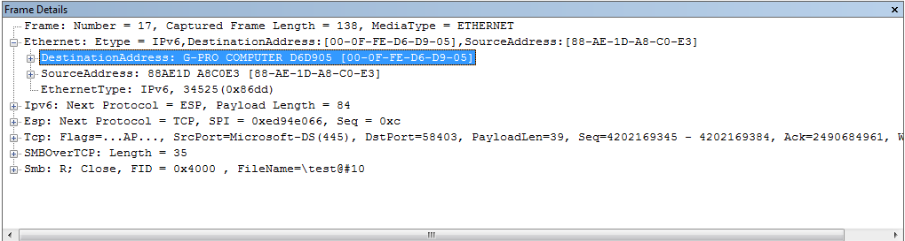
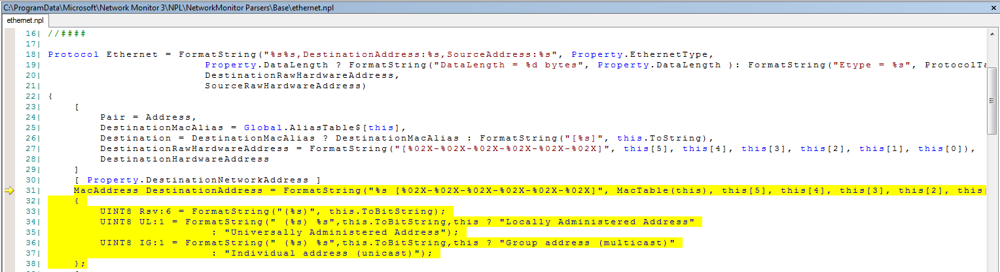
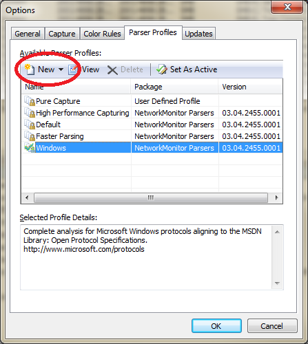
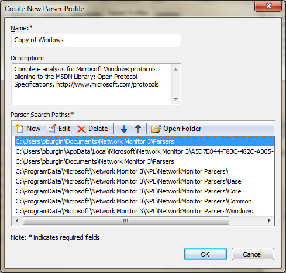
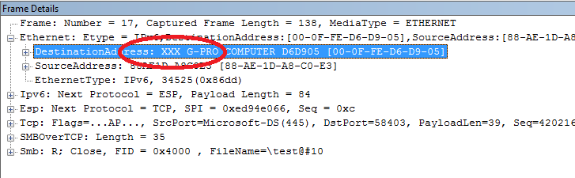

# Customizing In-Box Netmon Parsers. How to edit and deploy updated Netmon Parsers.

[Bryan S.
Burgin](https://social.msdn.microsoft.com/profile/Bryan%20S.%20Burgin)
8/8/2011 10:43:29 AM

-----

This article will explain how to edit and deploy an “in-box”  
Netmon parser.  By “in-box”, I refer to a  
parser that was installed with the Netmon package or was downloaded
and  
installed via <http://nmparsers.codeplex.com>.

 

The need to alter an in-box parser should be rare and done  
only with a full understanding of the consequences.  Parsers go through
regular maintenance where  
improvements and corrections are made.   
It is advisable to keep your parser collection up-to-date to realize  
these benefits.  Having a customized  
parser muddies this model.

 

Netmon marks all In-Box parsers as Read Only to protect them  
from editing.  It’s not immediately  
obvious, but by protecting the in-box parsers Netmon is protecting any  
customizations you make.  Without this  
protection, it is likely that your changes will get overwritten and lost
if the  
entire parser package is updated.  This  
requires you to make a copy of the parser you want to customize and edit
the  
copy.  The consequence is that if the  
parser you’re replacing is updated, you won’t realize any improvements
because  
Netmon will be pulling from your edited copy.   
Be aware of this condition and use this technique sparingly.

 

If you are editing a parser to make a fix, you should report  
problems to the Netmon parser team via the Network Monitor forum at
<http://social.technet.microsoft.com/Forums/en-US/netmon/threads>.

 

In this example, I will make a simple, textual change to the  
Ethernet parser.  To the output "DestinationAddress:  
\<computername\> \[\<MAC address\>\]”, I’ll add “XXX”, as in
“"DestinationAddress:  
XXX \<computername\> \[\<MAC address\>\]”.  This change has no value
except to illustrate  
the process to edit and deploy the change and to visually prove that the
change  
was picked up.

 

Before we begin, we need to identify the parser that is  
responsible for a specific line of output.   
This is easy to do with Netmon’s Go To Data Field Definition feature.

 

Take the following
frame:

[

If you right-click on any field, in our case  
“DestinationAddress”, and select “Go To Data Field” from the drop down
menu,  
Netmon will open a new window with the Netmon parser source code that
emitted  
that line.  In this case, it identified  
the file C:\\ProgramData\\Microsoft\\Network Monitor
3\\NPL\\NetworkMonitor  
Parsers\\Base\\Ethernet.npl (the parsers are in Netmon Parser Language,
.NPL  
files).

 

The feature further identified the source line that created  
the output:

 

“MacAddress DestinationAddress = FormatString("%s  
\[%02X-%02X-%02X-%02X-%02X-%02X\]", MacTable(this), this\[5\],
this\[4\],  
this\[3\], this\[2\], this\[1\],
this\[0\])”

[

 

This is what I want to edit.

 

First, copy the parser file to somewhere safe.  I would suggest
C:\\Users\\\<user\>\\Documents\\Network  
Monitor 3\\Parsers.  Thus, I copied

 

C:\\ProgramData\\Microsoft\\Network Monitor  
3\\NPL\\NetworkMonitor Parsers\\Base\\Ethernet.npl

To

C:\\Users\\\<user\>\\Documents\\Network Monitor
3\\Parsers\\Ethernet.npl.

 

I edited my private copy of Ethernet.npl by adding “XXX” to  
the text output and saved the file:

 

““MacAddress DestinationAddress = FormatString("XXX %s  
\[%02X-%02X-%02X-%02X-%02X-%02X\]", MacTable(this), this\[5\],
this\[4\],  
this\[3\], this\[2\], this\[1\], this\[0\])”

 

The next task is to cause Netmon to use your customized  
Ethernet.npl.  This requires you to have  
a custom (User) parser profile.  From  
Netmon’s main window, select Parser Profiles and then Parser Profile
Options.

[

 

Select (single-click) the Windows profile and then press  
New.  From New, you can select either a  
Blank Profile or Create from Selected.   
Select Create from Selected.   
Since you already selected the Windows profile, this will make a new  
profile based on the existing Windows profile.

 

Next, add a Parser Search Path that includes where your copy  
of Ethernet.npl lives.  Notice that the  
path was added to the bottom of the Parser Search
Path:

[

To ensure that your copy of Ethernet.npl takes precedent  
over its original, you must move 
C:\\Users\\\<user\>\\Documents\\Network  
Monitor 3\\Parsers to the top by selecting it and pressing the UP arrow
until it  
occupies the top
slot.

[

 

Then, save this profile by pressing OK.

 

Lastly, configure Netmon to use your customized  
profile.  Back on Netmon’s main window,  
select Parser Profiles and then User Defined Profiles and lastly Copy
of  
Windows (or, whatever name you gave the new profile).  Netmon will then
reload the parsers and  
re-parse your trace and you’ll realize your
modification:

 

[

 

