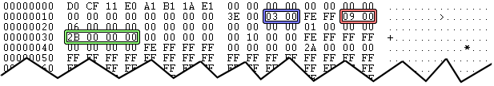

# Determining Office Binary File Format Types

[JCurry](https://social.msdn.microsoft.com/profile/JCurry) 1/16/2013
8:36:00 AM

-----

Referenced Documents:

  - [MS-CFB](http://msdn.microsoft.com/en-us/library/dd942138.aspx)
  - [MS-OLEPS](http://msdn.microsoft.com/en-us/library/dd942421.aspx)

 

If you need to programmatically determine the office file type for a
file and cannot rely on the file extension you can use the following
method. These files are based on the
[MS-CFB](http://msdn.microsoft.com/en-us/library/dd942138.aspx)
specification and you will have to parse the file accordingly. Here is
the method that you will need to follow to locate the name of the
application that created the file. I am using a .xls file that was
created with Microsoft Excel 2010 and saved in the Excel 97-2003
Workbook format for this example. The same method can be used for .doc
and .ppt files.

  
1\. Examine the file header
([section 2.2](http://msdn.microsoft.com/en-us/library/dd941946.aspx))
and check the values of the **Major Version** and the **Sector Shift**.
These will most likely be **0x0003** and **0x0009** respectively which
means that the sector size is **512 bytes**. If the Major Version is
0x0004 and the Sector Shift is 0x000C the sector size will be 4096 bytes
and you will need to adjust your file offset calculations accordingly. I
am going to assume that the sector size is 512 bytes for the purposes of
this explanation.

  
2\. At offset **0x30** you will find the **First Directory Sector
Location**. This value is 4 bytes in length. In my example file the
value is **0x0000002B**. One very important thing to understand is that
this is NOT a file offset location, it's an index. In order to locate
the First Directory Sector you take that value, add 1 to account for the
file header, and multiple that by the sector size (see step 1). This
will give you the actual file offset location of the First Directory
Sector. For my example file I use the following math to find it. **(0x2B
+ 0x01) \* 0x200 (512 bytes) =
0x5800**.

  
Figure 1: The CFB Header

  
3\. Locate the 512 byte block at the file location from step 2. This
will contain one or more **Compound File Directory Entry** structures
([section 2.6.1](http://msdn.microsoft.com/en-us/library/dd941946.aspx)),
each of which is **128 bytes** in length. Examine the **Directory Entry
Name** of each entry until you find one that contains 0x0005 + "Summary
Information".

  
4\. Once you have located the Summary Information entry you need to
locate and make note of the **Starting Sector Location** and **Stream
Size** properties. In my test file these values are **0x0000001A** and
**0x0000000000001000** respectively. Similar to how you located the
First Directory Sector Location (step 2), you need to find the location
of the Summary Information sector using the same type of calculation. In
my test file it looks like this.  **(0x1A + 0x01) \* 0x200 (512 bytes) =
0x3600**.

[  
Figure 2: The First Directory
Sector

  
5\. Go to the location that was calculated in step 4 and read the number
of bytes as specified by the Stream Size. In my case, I am going to file
offset 0x3600 and reading 0x1000 (4096) bytes. The contents of that
sector are contained in a **PropertySetStream** as specified in the
[MS-OLEPS](http://msdn.microsoft.com/en-us/library/dd942421.aspx)
specification
[section 2.21](http://msdn.microsoft.com/en-us/library/dd942207.aspx).

  
6\. Locate the **Offset0** value and jump to that offset in the sector.
In my test file, the Offset0 value is **0x30**. When I add this to the
file offset of the current sector I get **0x3630**. This location
contains a **PropertySet** structure
([section 2.20](http://msdn.microsoft.com/en-us/library/dd942379.aspx)).

  
7\. Skip over the next 8 bytes and you'll get to the list of
**PropertyIdentifierAndOffset** structures
([section 2.19](http://msdn.microsoft.com/en-us/library/dd942543.aspx)). 
Each PropertyIdentifierAndOffset is 8 bytes in length and contains the
**PropertyIdentifier** and **Offset** value. You want to find the one
with a PropertyIdentifier of **0x00000012** and make note of it's Offset
value. In my test file this is **0x00000070**.

***Note:** Property
0x00000012 is the **PIDSI\_APPNAME** identifier, which contains the name
of the application that created the file. The complete list of possible
SummaryInformation values can be found in section
[2.25.1](http://msdn.microsoft.com/en-us/library/dd942545.aspx).*

  
8\. The Offset value from step 7 must be added to the Offset0 value from
step 6 to correctly locate the Property. In my case, the property will
be located at **0x3630 + 0x70 = 0x36A0**. The contents at that location
are stored in a **TypedPropertyValue** structure
([section 2.15](http://msdn.microsoft.com/en-us/library/dd942532.aspx)).
The **Type** should be **0x001E** which indicates that the Value will be
stored as a **CodePageString**. You can ignore the Padding bytes.

  
9\. The **Value** is stored as a **CodePageString**
([section 2.5](http://msdn.microsoft.com/en-us/library/dd942354.aspx)).
The first 4 bytes indicate the length of the string, followed by the
actual string. In my example file the **Size** is **0x10** (16 bytes)
and the **Characters** value is **"Microsoft Excel" + 0x00**. The 0x00
at the end is the standard string terminator.

***Note:** For .doc
files the Size should be **0x18** (24 bytes) and the Characters value
should be **"Microsoft Office Word"+ 0x00** plus 2 extra bytes of
padding. For .ppt files the Size should be **0x1C** (28 bytes) and the
Characters value should be **"Microsoft Office PowerPoint" +
0x00**.*

[  
Figure 3: The Summary Information
Sector

