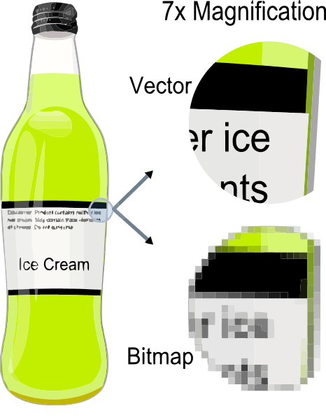
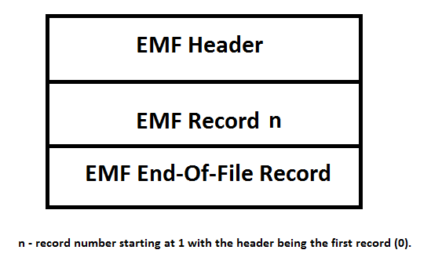

# EMF File Overview

[King Salemno](https://social.msdn.microsoft.com/profile/King%20Salemno)
6/28/2011 2:03:00 PM

-----

# EMF File Overview

 

Generally, most people are familiar with two types of graphics files:
bitmap and vector.

Bitmapped graphics present a 1-to-1 pixel representation of an image.
This is also known as raster graphics. These types of files cannot be
scaled easily as they are resolution dependent. The resolution is
determined by how many pixels were used to represent the image in
question. Since this value is static, enlarging such an image will
usually result in a loss of quality.

Vector graphics on the other-hand use geometric primitives to comprise
an image. Due to the fact they can be calculated via mathematical
equations, this makes generating graphics programmatically fairly
simple. This also makes for a much clearer picture when enlarging
pictures, as these files are not resolution dependent. Thus, enlarging a
photo will not result in the loss of any
quality.

**\[Image courtesy of
Wikipedia\]**

There is a 3rd type of graphics file is an Enhanced Metafile (EMF). This
type of file MAY contain both bitmapped and vector graphic elements.
Instead of an image being represented by pixel points or geometric
primitives, an EMF image is constructed by issuing a series of function
calls to the Windows Graphics Device Interface (GDI).

The file is constructed by a series of records that are read
sequentially until the end-of-file record has been encountered. At the
beginning of the file we have a special record called the ***EMF
Header***. At the end of the file we have another special record
referred to as the ***End-of-File*** record. The resulting records
contained in between these two are a record whose type is determined by
the ***RecordType*** enumeration in the record
itself.

Generally, all records start with a type and a size, indicating the type
of record we are dealing with, and the size in bytes of the current
record in processing (the size includes the first 8 bytes which contain
the type and size). From this point on, the remaining fields in the
record will be different, depending on the type of record.

For example, an EMR\_SETPIXELV Record looks like the following:

*EMR\_SETPIXELV*

**Type (4 bytes)**:  A 32-bit unsigned integer that identifies this
record type as EMR\_SETPIXELV. This MUST be 0x0000000F.

**Size (4 bytes)**:  A 32-bit unsigned integer that specifies the size
of this record, in bytes.

**Pixel (8 bytes)**:  A 64-bit WMF PointL object (\[MS-WMF\] section
2.2.2.15) that specifies the logical coordinates for the pixel.

**Color (4 bytes)**:  A 32-bit WMF ColorRef object (\[MS-WMF\] section
2.2.2.8) that specifies the pixel color.

The design of an EMF was constructed with the primary goal of being
device independent, relying solely on calls to the graphics API. Thus,
depending on the functions being called, the graphic in question could
contain both vector or bitmap elements as earlier stated depending on
the functions being called. The way this is accomplished is through the
use of a ***reference device*** whose dimensions are specified in each
individual file.

 

