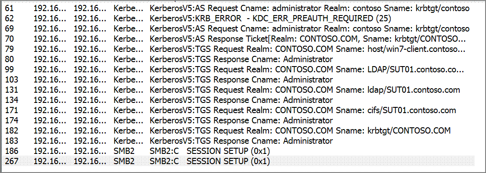
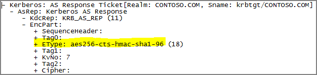
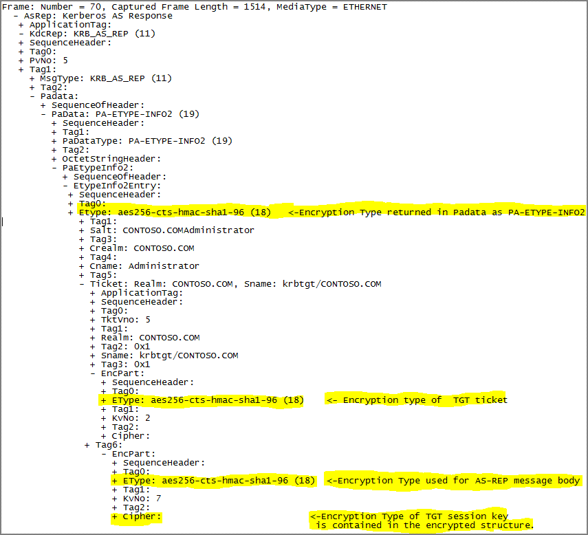
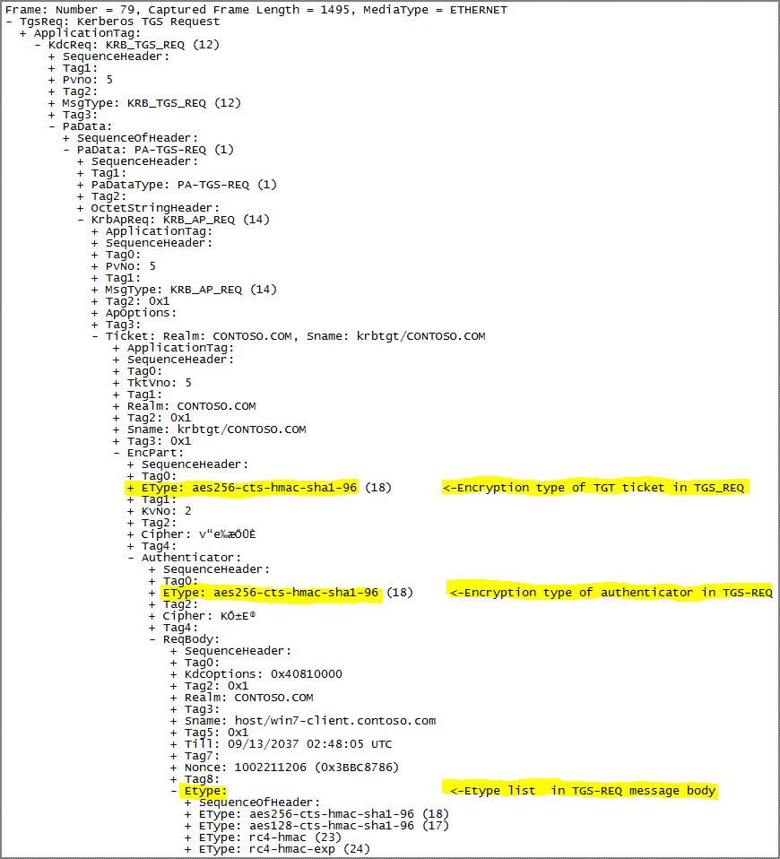
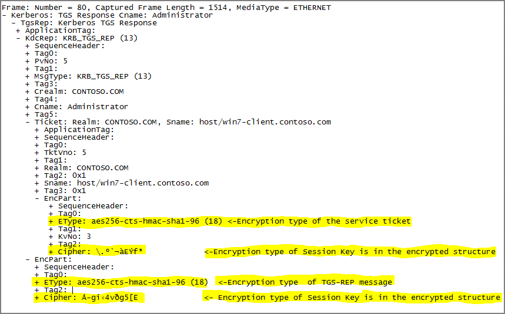

# Encryption Type Selection in Kerberos Exchanges

[Hongwei
Sun-MSFT](https://social.msdn.microsoft.com/profile/Hongwei%20Sun-MSFT)
11/17/2010 3:42:00
PM

-----

    
The types of encryption used in various Kerberos exchanges are
very important and sometime confusing aspects of the Kerberos
implementation.  We not only
need to understand the Kerberos RFC (RFC 4120, RFC 3961 etc) that
specifies generally how the encryption types should be selected, but
also the effects of Windows
 Active Directory and registry
settings on the selection of encryption
types.     To make it a little
bit more complicated, for most of Kerberos exchanges (AS, TGS and AP),
there may be more than one encryption types, which may be selected
differently,   present in a
single request or response. 

 

   In
this blog, we will take a look at the encryption types in the AS/TGS
exchanges of Kerberos, using a typical scenario shown in the network
capture. 
  We will show how to
find the various encryption types in the network packets and then
explain the logics of selecting encryption types by the client and the
KDC.   This may help
the understanding
of the connection between protocol details and live network traffic.  We
have to note that the logics are all documented in the Kerberos RFC
(4120) and MS-KILE,the Mircosoft extension to Kerberos V5,  we just
summarize them here with the sample network
packets.   ** ** 

      

    

                                                 **Fig.1   
A typical Kerberos
exchanges**

**Basic
Structures**

  

 
Let us first look at some important structures used in all encrypted
parts of Kerberos
    exchanges.

  - 
    
    

    
    **EncryptedData**
    
    

 

   Just as documented in [RFC
4120](http://blogs.msdn.com/controlpanel/blogs/posteditor.aspx/RFC%204120 "http://www.ietf.org/rfc/rfc4120.txt"),  many
parts of Kerberos messages, such as authenticator, ticket and encrypted
response, contain
*EncryptedData* as the container of arbitrary encrypted
data.   The fields contain all
the information that a recipient needs to decrypt the encrypted
data.    The following network
packet shows the layout of an EncryptedData structure, which is an
encrypted part of a AS-REP .   
Please note that in the fields, KvNo is
optional.   

  
 

  - 
    
    

    
    **EncryptionKey**
    
    

   The
*encryptionKey* is the on-wire structure of a session key that is used
for encryption and
decryption.   A
session key is always a  combination of  the key type and key
values.   A session key is sent over the wire between client
and server in either tickets or the encrypted parts of exchanges, but
never appear clear text on the
wire.     

**AS-REQ  
([RFC 4120
3.1.1](http://blogs.msdn.com/controlpanel/blogs/posteditor.aspx/RFC%204120%203.1.1 "http://www.ietf.org/rfc/rfc4120.txt"))**

**     **

**   **This
exchange is typically used at the initiation of a log in session to
obtain credentials for a Ticket-Granting Ticket (TGT), which will
subsequently be
used
to obtain credentials for other
services/servers.  

The
client sends a request to the KDC for a **ticket-granting ticket (TGT)**
(\[RFC4120\] section 5.3). The client presents its principal name and
can present pre-authentication
information.   The AS-REQ
message is not encrypted except the pre-authentication part if
present.    If
pre-authentication part is required for the user, but it is not present
in the AS-REQ, there will be multiple of trips of AS-REQ/AS-REP
exchanges until correct form of pre-authentication data is received by
KDC or KDC will fail the request.   The
following is a typical AS-REQ packet with the encryption types
highlighted.

 

          

        
 Now let us take a look at how 
the
encryption types involved in AS-REQ are selected. 
    

  - 
    
    

    
     **Etype
    in AS-REQ message
    body                    
    **
    
    

         This
is the list of encryption types in a preference order that the client
can support.  It is dependent on
the cypto systems available on the client
.   
The
following is the list of the encryption available for each Windows
system 

        
Windows
2000,  XP,Windows Server 2003:      DES, RC4  
         Vista , Windows Server 2008:      DES, RC4,AES  
         Windows 7 and  Windows Server  2008 R2:     DES(disabled by
default),
    RC4,AES

  - ** Encryption
    Type for PA-ENC-TIMESTAMP
     in
    paData       
    **

        
This is the encryption type used for the time stamp in
pre-authentication.   This is the encyption  type used by a client to
encrypted paData that will be decrypted by
KDC.     
         If a client sends PA-ENC-TIMESTAMP   in paData  in the initial
AS-REQ, it will use the strongest encryption type with the key 
available on the client machine.    
         If a client sends AS-REQ after receiving
KDC\_ERR\_PREAUTH\_REQUIRED, it will  use the strongest encryption
returned in the paData in the AS-REP that returns the error
KDC\_ERR\_PREAUTH\_REQUIRED.

**AS-REP ([RFC 4120
3.1.3](http://blogs.msdn.com/controlpanel/blogs/posteditor.aspx/RFC&nbsp;4120%203.1.3 "http://www.ietf.org/rfc/rfc4120.txt")) **

         
In AS-REP, KDC returns a TGT and a
session key that a
client can use to encrypt and authenticate communication with the KDC
for ticket-granting service
(TGS) requests, without reusing the persistent key.
 The following are the
encryption types involved in AS-REP and their selection
criteria.

 

  -  **Encryption
    Type used for encrypting AS-REP message
    body  
    **

**        **
This
is the type of encryption used for AS-REP message body.   The KDC
selects an encyption type to encrypt the message and the client decrypts
the message.   In Windows 2000 and Windows
Server 2003,  the KDC selects the
encryption type based on the preference order in the client request. In
Windows Server 2008, and Windows
Server 2008 R2,  the KDC selects
the encryption type used for pre-authentication, or, when
pre-authentication is not used, the encryption type based on the
preference order in the client
request[\[MS-KILE-WBN12](http://blogs.msdn.com/controlpanel/blogs/posteditor.aspx/%5BMS-KILE-WBN12 "http://msdn.microsoft.com/en-us/library/1163bb03-7035-433e-b5a4-802247262d18(v=PROT.13)#id12")\].  
Certainly the selected encryption type has to be supported by the KDC
too.

  -  **Encryption
    type of  TGT
    ticket   **

******        **
This
is the encryption type of the encrypted part of  a TGT ticket returned
to the client by the KDC.   The KDC selects this encryption type to
encrypt the TGT ticket and the KDC will decrypt the TGT ticket when the
client presents the TGT ticket to request a service ticket in TGS-REQ
phase.   The client doesn't really need to know how to decrypt TGT
ticket.   Therefore , KDC just needs to use setting of krbtgt account
,under which the KDC runs, and other settings on DC  to select an
encryption type for TGT
ticket.   

              If 
[USER\_USE\_DES\_KEY\_ONLY ](http://blogs.msdn.com/controlpanel/blogs/posteditor.aspx/%3Cspan%20style= "http://msdn.microsoft.com/en-us/library/cc245514(PROT.10).aspx")of
UserAcountControl attribute on krbtgt account is set  
                     KDC’s supported encryption list includes only DES
encryption.  
              Else  
                     If KDC is running on DC before Windows 2008  
                           KDC’s supported encryption list includes RC4
and DES.  
                     Else  
                            KDC’s supported encryption list includes
AES, RC4 and DES.  
    
                If   registry setting
[KdcUseRequestedEtypesForTickets
](http://blogs.msdn.com/controlpanel/blogs/posteditor.aspx/KdcUseRequestedEtypesForTickets "http://technet.microsoft.com/en-us/library/cc738673(WS.10).aspx")is
1   
                      KDC will pick the first entry in requested
encryption list sent in AS-REQ                 
                Else  
                       KDC will select a strongest encryption from the
KDC’s supported encryption list.  

              
Please refer to  [MS-KILE
3.3.5.3](http://blogs.msdn.com/controlpanel/blogs/posteditor.aspx/MS-KILE%203.3.5.3 "http://msdn.microsoft.com/en-us/library/cc233946(v=PROT.13).aspx") for
more details.          
    

  -  **Encryption
    Type returned in Padata as
    PA-ETYPE-INFO2**

         This
is the encryption type the client should use to generate a key to
decrypt the encrypted part of the AS-REP message using password in
conjunction with the salt value that is also returned in this Padata
entry.  This has to be supported by both KDC and the client.  The KDC
sets it to the encryption type that the client uses for the encyption of
PA-ENC-TIMESTAMP in Padata in the
AS-REQ.

  - ** Encryption
    Type of  TGT session
    key   **

               The
KDC sends the TGT session key in the encrypted part of AS-REP so the
client can use it to encrypt the future TGS exchanges to request service
ticket.  This cannot be observed
on the network packet since it is in the cipher part.   The KDC and the
client should both support this type of the
encryption.     The
KDC selects the strongest common encryption between what the client
requests in AS-REQ and KDC’s supported encryption list as determined in
the section  for selecting ***the encryption type of TGT
ticket***.                     

****

**TGS-REQ 
([RFC 4120
3.3.1](http://blogs.msdn.com/controlpanel/blogs/posteditor.aspx/RFC%204120%203.3.1 "http://www.ietf.org/rfc/rfc4120.txt")) **

          In
TGS-REQ,  The client sends a
request to KDC for a ticket for a
service.  The client presents
TGT ticket received in AS-REP , an authenticator and the SPN of the
service.  The following are the
encryption types involved

     

  -   **Etype
    list  in TGS-REQ message
    body     
    **

              This
is the list of encryption
types the client can
support.  
The logic is the same as the ***EType in AS-REQ Message
Body.***

  - ** Encryption
    type of TGT ticket in TGS\_REQ    
    **

        
This
is the encryption type of the TGT ticket received in the AS-REP. 
The encyption and decryption of the TGT ticket are only done by the
KDC.   The client just forwards the TGT ticket without decrypting it so
the encryption type is  selected
by the KDC in the previous AS-REP.

  -  **Encryption
    type of authenticator in
    TGS-REQ    **

**        **This
is the encryption type used for the
authenticator.   
The encryption type has to be supported by both the client and
the KDC.   The client encrypts the authenticator and the KDC decrypts
it. 
This
encryption type is the same as the that of the TGT session key received
from the KDC in AS-REP because the client uses the TGT session key to
encrypt the
authenticator.

**TGS-REP
([RFC 4120
3.3.3](http://blogs.msdn.com/controlpanel/blogs/posteditor.aspx/RFC%204120%203.3.3 "http://www.ietf.org/rfc/rfc4120.txt"))**

 

        While
preparing for the TGS-REP,
 KDC validates the TGT and
authenticator.  If they are
valid , the KDC then returns a service ticket and a session key for
further communication between client and server. The following are
 the encryption types
involved:

 

 

  - 
    
     **Encryption
    type of the service
    ticket           
    **

****

         This
is the encryption type of the encrypted part of a service
ticket.   The KDC encrypts the service
ticket and the server  decrypts it. 
KDC
needs to select a strongest common type that can be used by the
application server and the KDC.  The client will never need to decrypt
the service
ticket. 

    
The supported encryption types of a server or service that the ticket is
issued for are determined as follows:  
        
If 
USER\_USE\_DES\_KEY\_ONLY of UserAcountControl attribute of the service
account is set  
            The supported encryption list contains only DES
encryptions.  
        Else  
           The supported encryption list is set to
msDS-SupportEncyptionTypes plus RC4 and
DES.   

     
     
Since 
[msDS-SupportEncyptionTypes](http://blogs.msdn.com/controlpanel/blogs/posteditor.aspx/msDS-SupportEncyptionTypes "http://msdn.microsoft.com/en-us/library/cc220375(PROT.10).aspx")
is not present on any computer account before Vista/Windows Server 2008,
therefore its supported encryption types are always set to RC4 and
DES .  If the ticket is for a DC  or a krbtgt account  with domain
functional level \> Windows Server 2008  , AES will be automatically
added.   See
section 3.3.5.4  of MS-KILE for the
    details.  

  - ** Encryption
    type  of TGS-REP
    message**

      
A part of the TGS-REP message itself is encrypted when returned to the
client that will in turn decrypt the message.   KDC has to pick up an
encryption that can be used by both the KDC and the client. 
The
session key used for encrypting TGS-REP message is either the session
key in the TGT ticket or the sub-session key in the authenticator, both
embedded in TGS-REQ.    Therefore, the
encryption type used is dependent on the  session key used that has the
first four bytes as the key type.

  - ** Encryption
    type  of Session
    Key          **

**       **
The  KDC returns a session key for client to encrypt the future AP
exchanges
between
the  client and the application
server.  The same session key
is also embedded in the service ticket.  The encryption type has
to be used by both the client and the application server.  The KDC
selects 
the
strongest common encryption type between the client’s encryption list
present in the TGS-REQ  and the
server’s supported encryption list as described in the logic for 
"***Encryption type for service
ticket***".

   
   I
hope that the discussion and the network packet samples can help you
understand the encryption types involved in the AS/TGS
exchanges.   The discussion
doesn’t cover some other aspects such as the encryption of PAC and
forwarded TGT as well as the encryption in AP exchanges, which could be
the topic of another
blog.

**\[Reference\]**

1.      
RFC
4120   [http://www.ietf.org/rfc/rfc4120.txt](http://www.ietf.org/rfc/rfc4120.txt)

2.      
\[MS-KILE\] 
[http://msdn.microsoft.com/en-us/library/cc233855(PROT.13).aspx](http://msdn.microsoft.com/en-us/library/cc233855\(PROT.13\).aspx)

 

 

