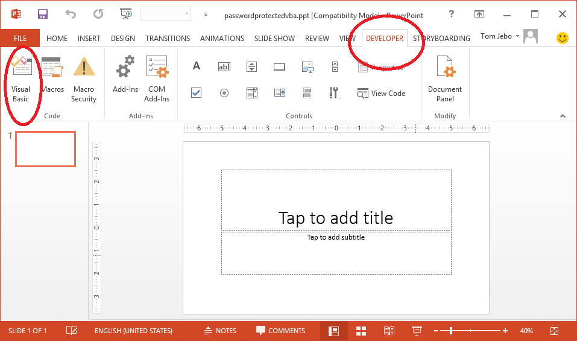
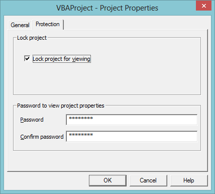
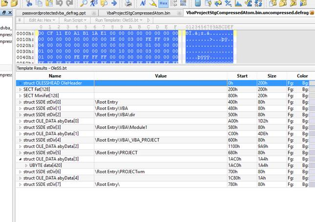

# Extracting a PowerPoint VBA Macro

[Tom Jebo](https://social.msdn.microsoft.com/profile/Tom%20Jebo)
6/20/2013 3:42:00 PM

-----

## Abstract

This post of my blog responds to a request by a customer to find and
extract a VBA macro in a PowerPoint file, specifically one stored in the
older binary file format, also known to many as BFF.

## Introduction

This post will take you through steps outlined in [\[MS-PPT\]
“PowerPoint (.ppt) Binary File
Format”](http://msdn.microsoft.com/en-us/library/cc313106\(v=office.12\).aspx)
section 2.1.2 “PowerPoint Document Stream”. In this section is an
algorithm for finding various important structures and objects in the
PowerPoint format. Because I only needed the VbaProjectStgCompressedAtom
object, specified in 2.10.42, which contains the storage for the VBA
macro, I didn’t need to go through the entire algorithm. Instead, the
approach I used was to look for the part of the algorithm which most
directly leads to the object (or its immediate parent), and then work
backward in the steps. This is not actually that hard to do, but care
must when  
moving backward in the algorithm not to miss important prerequisite
structures.

Because of this, it is also important for me to note that taking this
approach is not a substitute for reading the specification and
understanding the overall structure of a PowerPoint document format.

Also, what you see here is an example process based on one PowerPoint
document that was created specifically for this exercise.

The document used in this example was created in PowerPoint 2013 by
adding a VBA macro, placing password protection on it, and then saving
it as PowerPoint 97-2003 format (i.e. BFF). Below are screen shots for
this first
part.

 

[

*Figure 1.0*

 

 

The Developer tab you see in Figure 1.0, can be accessed after going to
File | Options…, selecting Customize Ribbon and checking the Developer
box on the right like in Figure
1.1.

 

*[*

*Figure 1.1*

 

Once you have the Developer tab, click the Visual Basic button and you
will be able to add code like in Figure
1.2.

 

[

*Figure 1.2*

 

Then, to password protect this sample macro, right click on “Module 1”
in the left hand tree view and select VBA Project Properties… In the
resulting dialog you will be able to enable protection and set the
password like in Figure
1.3.

 

[

*Figure 1.3*

 

Now exit out, saving the VBA macro. Then save the file as PowerPoint
97-2003 and you have a similar sample file to what I’m using for the
rest of this blog. Now the fun begins while we follow the steps in
\[MS-PPT\]\!

As in my other blogs on binary formats like this one, I use
[SweetScape’s 010 editor](http://sweetscape.com/) to display the data
in  structures along the way. I mention this because in my previous
posts, I’ve been asked what I used. [\[MS-PPT\] “PowerPoint (.ppt)
Binary File
Format”](http://msdn.microsoft.com/en-us/library/cc313106\(v=office.12\).aspx)
is hyperlinked here for reference but I will not include links for all
the sections as I walk through the steps below.

From here down to \[5. Read the VbaProjectStgrecord…\] I will merely
list the steps in section 2.1.2 followed by the resulting data found at
required locations. The steps and the highlighting speak for
themselves.  The excerpts from \[MS-PPT\] will be in *italics*. My
story line is in normal font and the hex output will be in
courier font.  I’ve also
tried to highlight using color to
make it easier to match fields with my comments and calculations.

 

## \[MS-PPT\] 2.1.2 PowerPoint Document Stream

######  

 

*Part 1: Construct the persist object directory.*

*1. Read the CurrentUserAtomrecord (section 2.3.2) from the Current User
Stream(section* *2.1.1). All seek operations in the steps that follow
this step are in the PowerPoint Document*
*Stream.*

 

[

 

1000h: 00 00 F6 0F 20 00 00 00
14 00 00 00 5F C0 91 E3  ..ö. .......\_À‘ã 

1010h:
**1A 99 00 00** 08 00 F4 03 03 00
62 1C 54 6F 6D 20  .™....ô...b.Tom   

1020h: 4A 65 62 6F 08 00 00 00
54 00 6F 00 6D 00 20 00  Jebo....T.o.m. . 

1030h: 4A 00 65 00 62 00 6F
00                          J.e.b.o.

 

*2. Seek, in the PowerPoint Document Stream, to the offset specified by
the* *offsetToCurrentEditfield of the CurrentUserAtomrecord identified
in step 1.*

 

 

CurrentUserAtomrecord.offsetToCurrentEdit
= **1A 99 00 00**

 

*3. Read the UserEditAtomrecord at the current offset. Let this record
be a live record.*

 

0x1200 + 0x991A = 0xAB1A

 

AB10h: 00 00 F3 8D 00 00 D3 8A
00 00 **00 00 F5 0F 1C 00**  ..ó

AB20h:
**00 00 00 00 00 00 81 11 00 03 00 00 00
00 FE 98**  ......

AB30h:
**00 00 01
00 00 00** 04 00 00 00 01 00 62 1C 00 00 
............b...

 

*Part 2: Identify the document persist object.*

*1. Read the docPersistIdReffield of the UserEditAtomrecord first
identified in step 3 of Part 1,* *that is, the UserEditAtomrecord
closest to the end of the stream.*

  

docPersistIdReffield =
**0x00000001**

 

*2. Lookup the value of the docPersistIdReffield in the persist object
directory constructed in step* *8 of Part 1 to find the stream offset of
a persist object.*

  

PersistDirectoryAtomrecord @ 0xAAFE

offsetLastEdit is 0x00000000

 

2.3.5 PersistDirectoryEntry bytes:

 

AAF0h: 83 87 97 5F 7A 7B 23 3A
FC 07 00 00 FF FF **00 00** 
ƒ‡—\_z{\#:ü...ÿÿ.. 

AB00h:
**72 17 14 00 00 00 01 00 40 00
00 00 00 00 F6 0B**
[r.......@.....ö](mailto:r.......@.....ö).  

AB10h:
**00 00 F3 8D 00 00 D3 8A 00 00**
00 00 F5 0F 1C 00  ..ó 

 

PersistOffsetEntry = **00 00 00
00**

 

 

*3. Seek to the stream offset specified in step 2.*

*4. Read the*
**DocumentContainerrecord** *at the
current offset. Let this record be a live record.*

 

1200h:
**0F 00 E8 03** EE 0B 00 00 01 00
E9 03 28 00 00 00  ..è.î.....é.(...  

1210h: 00 1E 00 00 E0 10 00 00
E0 10 00 00 80 16 00 00  ....à...à...€... 

1220h: 05 00 00 00 0A 00 00 00
00 00 00 00 00 00 00 00  ................

 

*Part 11: Identify the VBA project persist object.*

*1. Read the DocInfoListContainerrecord (section 2.4.4), if present,
specified by the docInfoList* *field of the DocumentContainerrecord
identified in step 4 of Part 2. If not present, skip to step* *6.*

  

**docInfoList** @0x148C

 

1480h: 00 00 00 00 00 00 00 80
00 00 00 00 **0F 00 D0 07** 
.......€......Ð. 

1490h: 44 01 00 00 1F 00 14 04
1C 00 00 00 00 00 15 04  D............... 

14A0h: 14 00 00 00 85 D1 F0 08
00 CA 9A 3B AD 07 94 C7  ....…Ñð..Êš;­.”Ç 

14B0h: 00 CA 9A 3B 01 02 00 00
1F 00 13 04 3C 00 00 00  .Êš;........\<... 

14C0h: 00 00 FD 03 34 00 00 00
01 00 00 00 01 00 00 00  ..ý.4........... 

14D0h: 01 00 00 00 01 00 00 00
54 B5 C6 00 DC AF C6 00  ........TµÆ.ܯÆ. 

14E0h: 08 00 00 00 18 B0 C6 00
68 B2 C6 00 1C B2 C6 00  .....°Æ.h²Æ..²Æ. 

14F0h: 00 00 00 00 00 00 00 00
00 01 C6 00 0F 00 FA 03  ..........Æ...ú. 

1500h: 47 00 00 00 00 00 FE 03
03 00 00 00 00 00 00 00  G.....þ......... 

1510h: 00 FD 03 34 00 00 00 72
00 00 00 64 00 00 00 72  .ý.4...r...d...r 

1520h: 00 00 00 64 00 00 00 3C
AF C6 00 08 00 00 00 30  ...d...\<¯Æ.....0 

1530h: B0 C6 00 03 00 00 00 7C
B2 C6 00 4C AF C6 00 86  °Æ.....|²Æ.L¯Æ.† 

1540h: 01 00 00 66 00 00 00 01
00 C6 00 **1F 00 FF 03 14** 
...f.....Æ...ÿ..  

1550h:
**00 00 00 02 00 00 04 0C 00 00 00 03 00
00 00 01**  ................ 

1560h:
**00 00 00 02 00 00 00 0F 00 88 13 69 00
00 00 0F**  .........ˆ.i.... 

 

 *2. Read the*
**VBAInfoContainer***(section
2.4.10) child record, if present, of the DocInfoListContainerrecord
identified in step 1. If no such child record exists, skip to step 6.*

  

1540h: 01 00 00 66 00 00 00 01
00 C6 00 **1F 00 FF 03 14** 
...f.....Æ...ÿ..  

1550h:
**00 00 00 02 00 00 04 0C 00 00 00 03 00
00 00 01**  ................ 

1560h:
**00 00 00 02 00 00 00 0F 00 88 13 69 00
00 00 0F**  .........ˆ.i.... 

  

*3. Lookup the value of the vbaInfoAtom.persistIdReffield of the
VBAInfoContainerrecord* *identified in step 2 in the persist object
directory constructed in step 8 of Part 1 to find the* *stream offset of
a persist object.*

  

vbaInfoAtom.persistIdReffield  = **03 00
00 00** = 3

 

 *4. Seek to the stream offset specified in step 3.*

  

From the persist object directory above:
**F3 8D 00 00** = offset 0x8DF3

PowerPoint Document stream @ 0x1200

So VbaProjectStorage record is at 0x1200 + 0x8DF3 = 0x9FF3

  

*5. Read the VbaProjectStgrecord at the current offset. Let this record
be a live record.*

 

I copied the VbaProjectStgCompressedAtom bytes from 010 editor into
another file.  This new file, then became a self-contained compound file
by the nature of its internal organization.

 

9FF0h: 00 00 00
**10 00 11 10
03 0B 00 00 00 22 00 00
78**  ............"..x 

A000h:
**01 EC 59 7D 6C 1C C5 15 7F BB 77 B6 CF
97 D8 B9**  .ìY}l.Å.»w¶Ï—ع 

A010h:
**18 13 12 93 C2 C6 06 E3 24 B6 D9 DD 3B
DF 07 B1**  ...“ÂÆ.ã$¶ÙÝ;ß.± 

A020h:
**69 6E EF C3 71 64 63 2B 46 71 A5 1E 84
B3 6F 8D**  inïÃqdc+Fq¥.„³o

…

…

…

Size of the compressed storage is: 03 0B
00 00 = 0xB03

 

I copied this entire block of bytes into a separate file and
decompressed them to obtain a fully independent compound file.

The decompression algorithm is referenced in 2.10.42
“VbaProjectStgCompressedAtom” and says:

*The original bytes of the storage are compressed by the algorithm
specified in \[RFC1950\] and are decompressed by the algorithm specified
in \[RFC1951\].*

So at this point, you will need to write some code to decompress this
using the [zlib compression](http://zlib.net/) library. There is example
code shown in Figure 1.4 at the end of this blog.

Back to the block of bytes in a separate file; this is indeed a
[\[MS-CFB\]](http://msdn.microsoft.com/en-us/library/dd942138.aspx)
conforming document with the VBA storages as specified in
[\[MS-OVBA\]](http://msdn.microsoft.com/en-us/library/cc313094\(v=office.12\).aspx).
Opening that in 010 or Offvis, you can see the
storages:

 

[

 

Now we can look at some of the stream data to convince ourselves that we
have a valid VBA macro storage here. Since it is password protected,
some of the fields are encrypted and look like just random data. But we
can look at, for instance, a stream named “PROJECT” which according to
\[MS-OVBA\]:

  

*2.3.1 PROJECT Stream: Project Information*

*The PROJECT stream (1) specifies properties of the VBA project.*

  

So, looking at the bytes at the beginning of it:

 

1AC0h: 49 44 3D 22 7B 30 30 30
30 30 30 30 30 2D 30 30  ID="{00000000-00 

1AD0h: 30 30 2D 30 30 30 30 2D
30 30 30 30 2D 30 30 30  00-0000-0000-000 

1AE0h: 30 30 30 30 30 30 30 30
30 7D 22 0D 0A 4D 6F 64  000000000}"..Mod 

1AF0h: 75 6C 65 3D 4D 6F 64 75
6C 65 31 0D 0A 48 65 6C  ule=Module1..Hel 

1B00h: 70 46 69 6C 65 3D 22 22
0D 0A 4E 61 6D 65 3D 22  pFile=""..Name=" 

1B10h: 56 42 41 50 72 6F 6A 65
63 74 22 0D 0A 48 65 6C  VBAProject"..Hel 

1B20h: 70 43 6F 6E 74 65 78 74
49 44 3D 22 30 22 0D 0A  pContextID="0".. 

1B30h: 56 65 72 73 69 6F 6E 43
6F 6D 70 61 74 69 62 6C  VersionCompatibl 

1B40h: 65 33 32 3D 22 33 39 33
32 32 32 30 30 30 22 0D  e32="393222000". 

1B50h: 0A 43 4D 47 3D 22 45 42
45 39 34 37 37 45 33 36  .CMG="EBE9477E36 

1B60h: 38 32 33 36 38 32 33 32
38 36 33 32 38 36 22 0D  82368232863286". 

1B70h: 0A 44 50 42 3D 22 44 36
44 34 37 41 36 42 38 45  .DPB="D6D47A6B8E 

1B80h: 42 44 36 34 44 41 36 34
44 41 39 42 32 36 36 35  BD64DA64DA9B2665 

1B90h: 44 41 31 37 43 37 39 36
32 31 44 46 44 31 30 37  DA17C79621DFD107 

1BA0h: 31 31 46 39 39 33 36 31
44 30 39 32 44 43 39 31  11F99361D092DC91 

1BB0h: 45 46 41 42 37 36 34 34
43 37 35 42 33 41 38 30  EFAB7644C75B3A80 

1BC0h: 35 39 36 42 22 0D 0A 47
43 3D 22 43 31 43 33 36  596B"..GC="C1C36 

1BD0h: 44 36 45 36 45 36 45 36
45 36 45 22 0D 0A 0D 0A  D6E6E6E6E6E".... 

1BE0h: 5B 48 6F 73 74 20 45 78
74 65 6E 64 65 72 20 49  \[Host Extender I 

1BF0h: 6E 66 6F 5D 0D 0A 26 48
30 30 30 30 30 30 30 31  nfo\]..\&H00000001 

1C00h: 3D 7B 33 38 33 32 44 36
34 30 2D 43 46 39 30 2D  ={3832D640-CF90- 

1C10h: 31 31 43 46 2D 38 45 34
33 2D 30 30 41 30 43 39  11CF-8E43-00A0C9 

1C20h: 31 31 30 30 35 41 7D 3B
56 42 45 3B 26 48 30 30  11005A};VBE;\&H00 

1C30h: 30 30 30 30 30 30 0D 0A
0D 0A 5B 57 6F 72 6B 73  000000....\[Works 

1C40h: 70 61 63 65 5D 0D 0A 4D
6F 64 75 6C 65 31 3D 32  pace\]..Module1=2 

1C50h: 36 2C 20 32 36 2C 20 31
34 32 38 2C 20 36 37 30  6, 26, 1428, 670 

1C60h: 2C 20 0D
0A                                      , ..

 

From this, we see properties like Name="VBAProject” and Module=Module1
which gives us some confidence that we have indeed the properties for a
VBA macro. For questions or comments about the contents of this blog,
please contact [Interoperability Documentation
Help](mailto:dochelp@microsoft.com).

 

*Figure 1.4 Example code to decompress the
VbaProjectStgCompressedAtom*

'===================================================================  

' DISCLAIMER:

'-------------------------------------------------------------------  

' 

' This sample is provided as is
and is not meant for use on a 

' production environment. It is
provided only for illustrative 

' purposes. The end user must
test and modify the sample to suit 

' their target environment.
' 

' Microsoft can make no
representation concerning the content of 

' this sample. Microsoft is
providing this information only as a 

' convenience to you. This is to
inform you that Microsoft has not 

' tested the sample and
therefore cannot make any representations 

' regarding the quality, safety,
or suitability of any code or 

' information found here.

'

'===================================================================

// assumptions for the input
file: 

// 1. it has nothing in it but
the a) 4 byte uncompressed length and b) compressed data

// 2. it is small enough to read
in and process in a reasonable buffer and processing time

// 

int main(int argc, char
\*argv\[\])

{

int
BlockSizeUncompress=0x1000;

int
cprLevel=Z\_BEST\_COMPRESSION;

FILE\* streamIn = NULL;

FILE\* streamOut = NULL;

enum

{

paramExe,

paramFileIn,

paramFileOut,

paramBlockSizeUncompress,

paramCompressLevel

};

if (argc\<paramFileOut)

{

printf("run decompress
\<FileIn\> \<FileOut\> \[BlockSizeUncompress\] \[compres.
level\]\\n"

"For example: decompress
inputfile.bin uncompressed.data.bin");

return 0;

}

if
(argc\>paramBlockSizeUncompress)

BlockSizeUncompress=atol(argv\[paramBlockSizeUncompress\]);

if
(argc\>paramCompressLevel)

cprLevel=(int)atol(argv\[paramCompressLevel\]);

byte\* pbOriginal; 

byte\* pbCompressed; 

// open the input file for
reading binary
data

streamIn=fopen(argv\[paramFileIn\],
"rb");

if (streamIn==NULL)

return 0;

// open the output file for
writing binary
data

streamOut=fopen(argv\[paramFileOut\],
"wb");

if (streamOut==NULL)

return 0;

// Beginning of main
decompression functionality

{

z\_stream zcpr;

int ret=Z\_OK;

long lOrigDone = 0;

int
step=0;

memset(\&zcpr,0,sizeof(z\_stream));

inflateInit(\&zcpr);

struct \_stat buf;

// find out how big the input
file is

if (\_stat(argv\[paramFileIn\],
\&buf))

{

printf("failed to read file
size");

return -4;

}

// allocate enough bytes for the
whole file.  

pbCompressed = (byte\*)  
malloc(buf.st\_size);

size\_t corig = 0; 

long lorig = 0; 

// read in the first 4 bytes
which is the size of the uncompressed

// data

if (fread(\&lorig, 1, 4,
streamIn) == 0)

{

printf("failed to read
uncompressed size");

return -4;

}

corig = lorig;

pbOriginal = (byte\*)
malloc(corig); 

ZeroMemory(pbOriginal,
sizeof(pbOriginal));

// read in the compressed data
from the input file

if (fread(pbCompressed, 1, 4096,
streamIn) == 0)

{

printf("failed to read
compressed data");

return -4;

}

zcpr.next\_in =
pbCompressed;

zcpr.next\_out =
pbOriginal;

zcpr.avail\_in =
buf.st\_size;

zcpr.avail\_out = lorig;

// call zlib to uncompress or
inflate the
data

do

{

ret=inflate(\&zcpr,Z\_SYNC\_FLUSH);

step++;

} while (ret==Z\_OK);

// write out the uncompressed
data to the output file.

fwrite(pbOriginal, 1, lorig,
streamOut);

inflateEnd(\&zcpr);

}

// clean up buffers and file
pointers

free(pbCompressed);

free(pbOriginal);

fclose(streamIn);

fclose(streamOut);

return 0;

}

