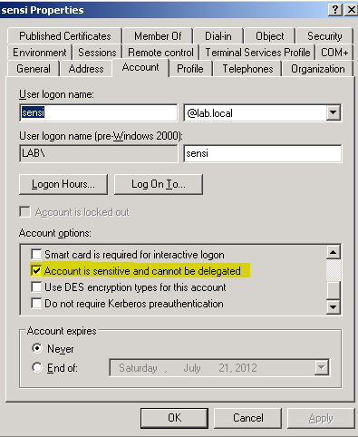
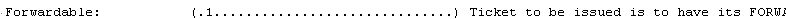
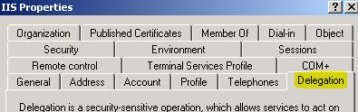
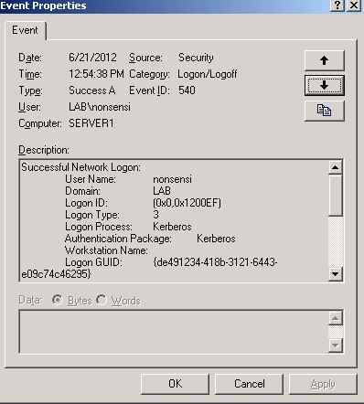

# MS-FSU: A look from the Windows interface

[Sebastian
Canevari](https://social.msdn.microsoft.com/profile/Sebastian%20Canevari)
6/25/2012 5:00:00 PM

-----

 

It is not unusual for our group to receive a question regarding
Constrained Delegation and Protocol Transition.

Even though the document
([MS-SFU](http://msdn.microsoft.com/en-us/library/cc246071)) does a
great job in detailing the specification, not all implementers are
familiar with the way in which Windows needs to be configured in order
to be able to fulfill the requirements of the protocol. The reason is
rather simple: many of the developers reading the documentation work on
operating systems other than Windows.

Although I am sure I have seen some blogs and articles explaining this,
I thought it could be a good idea to have these details in our blog
since it could help implementers using the Open Specification set of
documents.

I am not going to get into the details of the WHATs and WHYs because
those details are covered by the document.

I will instead, make sure the HOWs for configuring a Windows system to
work with these extensions are clear and complete.

**  
**

**How \#1:**

How to configure the
authenticating user account to be able to be delegated?

\-          Open ***dsa.msc***

\-          Locate the ***user account*** that will be used to access
the front end service and open its ***properties***

\-          If the ***“Account is sensitive and cannot be delegated”***
checkbox is check, then ***UNCHECK*** it

\-          Then commit the change clicking
***OK***

(In this example, ***LAB\\nonsensi*** is set to be delegated and
***LAB\\sensi*** is set NOT to be delegated)

When the checkbox is unchecked, the FORWARDABLE flag
(\[[RFC4120](http://www.ietf.org/rfc/rfc4120.txt)\] section 2.6) is set
in the
TGS-REQ.

The TGS-REP will provide the ticket with the FORWARDABLE flag only if
the rest of the settings are correct. If not, the ticket will not have
the FORWARDABLE flag on and the delegation will fail.

**How \#2:**

How to configure the middle
tier?

\-          Open ***dsa.msc***

\-          If you are running the service or application pool with a
computer account (network service, local service or local system) then
locate the ***computer account*** of the middle tier system and open its
***properties***

\-          Then select the following
options:  
  
  
  
The left side shows the settings for delegation without Protocol
Transition, the right side shows the settings for delegation with
Protocol Transition.

  - To confirm that the setting has been set correctly, use ADSIEDIT.MSC
    to look into the properties of the computer account:
      - Open **ADSIEDIT.MSC**
      - Expand the **Domain** node
      - Expand the domain where the computer account is hosted
      - Expand the **Computers** container
      - Right click on the account and select **Properties**
      - In the properties list, locate **msDS-AllowedToDelegateTo** and
        double click on it
      - It should look similar to
        this:  
        

\-          If you are running the service or application pool with a
user account then locate the ***user account*** of the middle tier
system and open its ***properties***

\-          Select the ***delegation tab***

  - If the delegation tab is not present, follow these steps:
      - If setspn.exe is not already in your server, you can download it
        from here: <http://support.microsoft.com/kb/970536>
      - From a command prompt run: setspn –A service/servername
        domainname\\serviceaccountname  
          
        Where:  
        \- *“service”* is the service name of the middle tier. In the
        example below is **http**  
        \- *“servername”* is the netbios name of the server where the
        middle tier is running. In the example below is **server3**  
        \- *“domainname”* is the netbios name of the domain. In the
        example below is **LAB**.  
        \- *“serviceaccountname”* is the name of the user under which
        the middle tier service is running. In the example below is
        **IIS**
      - Repeat the command with all the same parameters but instead of
        using the netbios name for servername, use the full dns name. In
        the example below is
        **server3.lab.local  
          
          
          
        **
  - Once the SPNs are created, the delegation tab will show up on the
    user
    account:  
      
      
      
  - If the tab is still not showing, verify the SPNs creating with
    **ADSIEDIT.MSC**
      - Open **ADSIEDIT.MSC**
      - Expand the **Domain** node
      - Expand the domain where the account is hosted
      - Expand the **Users** container
      - Right click on the account and select **Properties**
      - In the properties list, locate servicePrincipalName and double
        click on it
      - It should look similar to
        this:  
          
          
        If it doesn’t, then make sure to clean up the list and repeat
        the setspn process.

 **How \#3**

Is it working?

In this scenario, there is a webpage called **test.hml** hosted in
**Server1** that is served by an **IIS** server in **Server3**.

The applicaton pool in **Server3** is running under the **network
service account**.

The web page contains 2 pictures with different sets of local
permissions.

User **nonsensi** has permissions on **picture.jpg** but does not have
permissions on **picture2.jpg**

When accessing the webpage from a client computer using Internet
Explorer, this is what he
sees:  

As we can see, the page has been served and the picture to which only
**sensi** has permissions has not been displayed.

We can see that the user credentials were used to access the backend
server:

And this was done because the ticket with nonsensi’s credentials was
forwardable:

 

I truly hope that you find this article useful when working on
implementing and testing your implementation with Windows.

 

 

