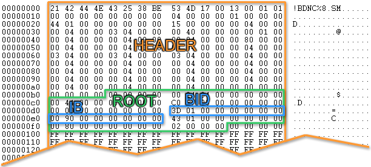
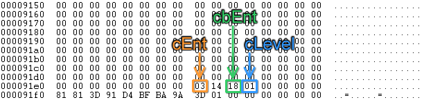
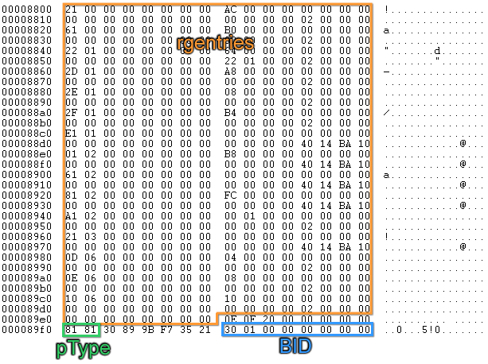
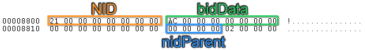

# MS-PST - How to Navigate the Node BTree

[JCurry](https://social.msdn.microsoft.com/profile/JCurry) 11/30/2010
11:29:00 AM

-----

The current version of the MS-PST open specification document can be
found here:
<http://msdn.microsoft.com/en-us/library/ff385210(office.12).aspx>

 

 

Introduction

The PST is a structured binary file format that contains messages,
folders, and attachments. The file structure can be logically separated
into 3 layers: the Node Database (NBD) layer, the Lists, Tables, and
Properties (LTP) layer, and the Messaging layer. Each layer builds on
the one before and because of this it is necessary to completely
understand the NDB layer before the LTP layer, and to understand the LTP
layer before the Messaging layer. Like building a house, you cannot
start framing the walls until you pour the foundation. The Node BTree,
which is an important part of the NBD layer is part of that foundation.
Without it, you could not hope to be able to understand how the PST file
format works much less be able to find what you are looking for.

 

We will be focusing on the Unicode version of the PST file format that
was introduced in Outlook 2003 since most of the PST files you are
likely to be working with will be in this format. Information on the
differences between the Unicode and ANSI version can be found in section
[2.2.1.2](http://msdn.microsoft.com/en-us/library/ff387514\(office.12\).aspx).

 

 

Structures that you should be familiar
with

[HEADER](http://msdn.microsoft.com/en-us/library/ff387474\(office.12\).aspx):
The structure at the beginning of the file that contains meta-data about
the PST
file.

[ROOT](http://msdn.microsoft.com/en-us/library/ff385608\(office.12\).aspx):
A structure in the HEADER that contains file state
information.

[BREF](http://msdn.microsoft.com/en-us/library/ff386638\(office.12\).aspx):
A structure that contains a BID/IB
pair.

[BID](http://msdn.microsoft.com/en-us/library/ff387585\(office.12\).aspx):
Block ID, a unique
identifier.

[NID](http://msdn.microsoft.com/en-us/library/ff385251\(office.12\).aspx):
Node ID, a unique
identifier

[IB](http://msdn.microsoft.com/en-us/library/ff386553\(office.12\).aspx):
Byte Index, an unsigned 64-bit value that represents an absolute file
position.

[BTree](http://msdn.microsoft.com/en-us/library/ff386554\(office.12\).aspx):
Generic binary tree structure.

NBT: The Node
BTree.

[Page](http://msdn.microsoft.com/en-us/library/ff386116\(office.12\).aspx):
A generic 512 byte section of the
file.

[PageTrailer](http://msdn.microsoft.com/en-us/library/ff387943\(office.12\).aspx):
A 16 byte structure at the end of each Page that contains meta-data
about the
page.

[BTPage](http://msdn.microsoft.com/en-us/library/ff385991\(office.12\).aspx):
A 512 byte page that is part of the Node or Block
BTree.

[BTEntry](http://msdn.microsoft.com/en-us/library/ff387350\(office.12\).aspx):
Generic BTree
entry.

[NBTEntry](http://msdn.microsoft.com/en-us/library/ff385505\(office.12\).aspx):
Leaf node entries in the Node BTree.

 

 

Got Root?

The ROOT structure in the HEADER contains the BREFNBT structure. This is
a BREF structure, which contains a BID structure and an IB. The IB is
the second 64 bits that represents an unsigned 64-bit integer and the
absolute offset into the file where the first NBT page exists. In a
Unicode PST file, we can find the IB at offset
0xE0.

 

 

Figure 1: How to find the location of the NBT Root page.

 

 

Remember that the value is stored in Little Endian format on disk, so
what you see in the file laid out as "00 90 00 00 00 00 00 00" becomes
"00 00 00 00 00 00 90 00" when read into memory. Using this we can see
that the first NBT page is located at offset 0x9000.

 

 

The NBT Root Page

The following is the root NBT page for a new PST file. Yours might look
slightly
different.

 

 

Figure 2: The NBT Root page.

 

 

The first 488 bytes is an array of rgentries. By referring to the table
in section
[2.2.2.7.1](http://msdn.microsoft.com/en-us/library/ff387943\(office.12\).aspx)
we can verify that the pType property 0x81 is pTypeNBT. We can also see
that the BID in the PageTrailer matches the BID from the BREFNBT
structure in the ROOT. It's good to verify that the data we are looking
at is the data structure we expect it to be.

 

Looking at the section right before the PageTrailer, there are 3
important properties that will determine how you read the data in the
rgentries
array...

 

 

Figure 3: How to decipher the rgentries block.

 

 

The number of entries in the rgentries array is discovered by reading
the cEnt byte. The cbEnt byte tells us the size of each entry in bytes.
The entries will be of type BTENTRY if the cLevel byte is greater than 0
(see section
[2.2.2.7.7.1](http://msdn.microsoft.com/en-us/library/ff385991\(office.12\).aspx)).
So, in Figure 3 we can see that the rgentries array contains 3 entries,
each one is 0x18 (24) bytes in length, and they are going to be BTENTRY
structures.

 

So, lets take a look at one of these
entries.

 

 

Figure 4: A sample BTENTRY.

 

 

The first 8 bytes are the btKey and the 16 bytes that follow is the BREF
structure. The important part of the BREF is the IB which is the last 8
bytes which tells us where the next page is in the file. So, this entry
has a key of 0x21 (33), the Block ID is 0x130 and the Page that it
points to is at offset 0x8800.

 

After reading the contents of the 3 records in the rgentries array, our
Node BTree looks like
this:

 

 

Figure 5: The Node BTree structure up to this point.

 

 

Traversing the Node BTree

Lets look at the first NBTPage that the Root page points to at offset
0x8800

 

 

Figure 6: A sample NBT page.

 

 

This one has the familiar page type of 0x81 (pTypeNBT) and we can verify
that the BID matches (0x130). Other than that it looks a lot different.
Following the same logic as before we can see that this page contains
0x0E (14) entries and that each one is 0x20 (32) bytes in length. cLevel
is 0 this time which means the entries are NBTENTRY types (see section
[2.2.2.7.7.1](http://msdn.microsoft.com/en-us/library/ff385991\(office.12\).aspx)).
This tells us that we are at the leaf node of the tree. If cLevel was
greater than 0 we would follow the same logic as we did with the entries
on the NBTRoot page.

 

Lets take a look at the first
NBTENTRY…

 

 

Figure 7: A sample NBTENTRY.

 

 

The first 8 bytes is the NID which is 0x21. The next 8 bytes is
the  BID of the data block for
this node (0xAC). That tells us the node ID of the block in the Block
Btree where the actual data is for this node. The next 8 bytes is the
BID of the subnode block for this node. In this case, there isn't one.
The next 4 bytes is the parent NID. The parent NID contains the ID of
the folder object that the data that belongs to this node belongs to. In
other words, if the data that this node points to represents is an
e-mail, the parent NID is the ID of the folder that the e-mail resides
in. The last 4 bytes is for alignment purposes and should be ignored.

 

Following this logic you should have no problem building the complete
Node BTree.

