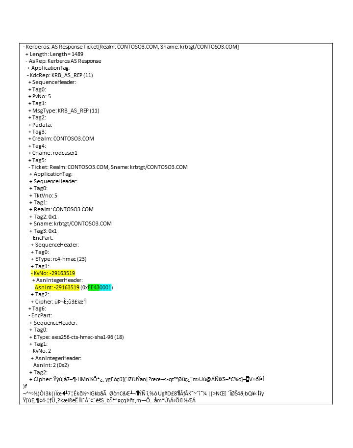
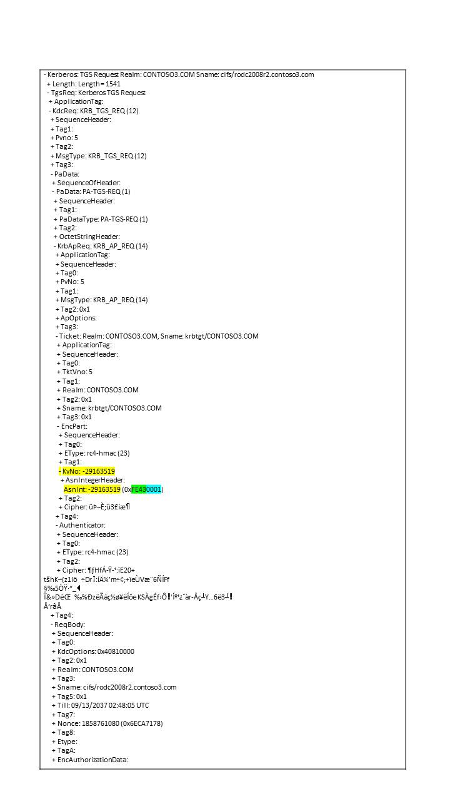

# Notes on Kerberos kvno in Windows RODC environment

[Edgar A
Olougouna](https://social.msdn.microsoft.com/profile/Edgar%20A%20Olougouna)
5/11/2011 8:52:00
AM

-----

This blog
talks about key version number (kvno) in a read-only domain controller
(RODC) environment. A [previous
blog](http://blogs.msdn.com/b/openspecification/archive/2009/11/13/to-kvno-or-not-to-kvno-what-is-the-version.aspx) introduced
kvno in general. Here, I look at specifics in RODC environment.

For a
refresher, the kvno is a field of the EncryptedData structure
([RFC4120](http://www.ietf.org/rfc/rfc4120.txt)
Section 5.2.9). It
indicates the version number of the key
used to encrypt data.  When a Kerberos peer needs to decrypt an
EncryptedData structure from a message, it must use the exact version of
the key that was used to encrypt the message.

 

   EncryptedData   ::=
SEQUENCE {

           etype   \[0\]
Int32 -- EncryptionType --,

           kvno    \[1\]
UInt32 OPTIONAL,

           cipher  \[2\]
OCTET STRING -- ciphertext

  
}

 

RFC4120
describes the kvno as follows.

 

   Key Version Number
(kvno)

      A tag associated with
encrypted data identifies which key was used

      for encryption when a
long-lived key associated with a principal

      changes over time.  It
is used during the transition to a new key

      so that the party
decrypting a message can tell whether the data

      was encrypted with the
old or the new key.

 

An
[RODC](http://technet.microsoft.com/en-us/library/cc732801\(WS.10\).aspx)
is a new type of domain controller introduced in Windows Server 2008. An
RODC hosts read-only partitions of the Active Directory Domain Services
(AD DS) database. An RODC is typically deployed in a branch office. The
RODC is advertised as a Key Distribution Center (KDC) for the branch
office.

 

Cryptographic
isolation is achieved between RODC KDCs in branch offices by using a
special type of krbtgt accounts. That is, an RODC uses a different
krbtgt account and password than the KDC on a writable domain controller
uses when it signs or encrypts ticket-granting ticket (TGT) requests.
When an RODC recognizes that another DC signs the TGT, it forwards
related requests to the writeable
DC.

 

Each
RODC KDC has a special krbtgt account in form of krbtgt\_\<RodcID\>. The
RodcId identifies the RODC and is generated when the RODC is installed.
Its value is stored in the msDS-SecondaryKrbTgtNumber attribute (see
example below, the attribute is documented in MS-ADA2).

The
RodcID value is randomly chosen by the system between 1 and 0xFFFF, but
is unique across the domain, as specified in MS-ADTS 3.1.1.3.4.1.23
LDAP\_SERVER\_RODC\_DCPROMO\_OID. Only SYSTEM has the write privilege on
the msDS-SecondaryKrbTgtNumber attribute; this is a system only
attribute, and is not meant to be modified. 

Like in
any writeable DC, the RODC krbtgt\_\<RodcID\> account is under the
CN=Users,DC=contoso3,DC=com container. Its cn, name and sAMAccountName
are krbtgt\_\<RodcID\>.  Unlike a regular krbtgt account, this account
does not have servicePrincipalName: kadmin/changepw. The kadmin/changepw
service is not needed on an RODC since it enables changing a principal’s
password via Kerberos
([\[RFC3244\]](http://go.microsoft.com/fwlink/?LinkId=90409)).
An example of the LDAP record of a RODC krbtgt account is provided at
the end of this
blog.

 

Windows
RODC implementation generates kvnos as defined in MS-KILE 3.1.5.8. When
a TGT is issued by an RODC, the first 16 bits of the kvno, including the
most significant bit, are an unsigned 16-bit and identify the RODC
instance. The remaining 16 bits are the version number of the key
(typically the version number is incremented by one when the password
changes).

 

In
an example where the RodcID is 65091 (i.e. 0xFE43), and the key version
is 1, the encoding is shown on the wire as follows: KvNo: A1 06 02 04 FE
43 00
01.

 

In
the AS response below, the EncPart of TGT ticket is encrypted with the
RODC key and has a kvno which identifies the RODC. The EncPart of the
KRB\_AS\_REP is encrypted with the client key and has a regular kvno.
The client’s key is derived upon replication from a writable DC and is
not tied to the
RODC.

[ 

 

 

When
the client sends the TGS-REQ and presents the TGT that was issued by
this particular RODC, the RodcID of the kvno (first 16 bits, e.g.
0xFE43) has to match the
RodcID of the krbtgt\_\<RodcID\> account. Likewise, the version of the
key (remaining 16 bits of the kvno, e.g.
0x0001) has to match a
version of the key stored on the RODC.

 

[

It
should be noted that if the TGS-REQ is malformed, e.g. Kvno encoded with
more than 4 bytes, it is possible that the KDC discards the request
without an error indication, for the purpose of mitigating a security
attack.

 

In
the TGS response, the EncPart of the TGS ticket is encrypted with the
server’s long-term key and has a regular Kvno. The server’s long-term
key is derived upon replication from a writable DC and is not tied to
the
RODC.

[

Example
of LDAP record for RODC krbtgt
account

-----------

Dn:
CN=krbtgt\_65091,CN=Users,DC=contoso3,DC=com

accountExpires:
9223372036854775807 (never);

cn:
krbtgt\_65091;

codePage:
0;

countryCode:
0;

description:
Key Distribution Center service account for read-only domain controller;

distinguishedName:
CN=krbtgt\_65091,CN=Users,DC=contoso3,DC=com;

dSCorePropagationData:
0x0 = (  );

instanceType:
0x0 = (  );

msDS-KrbTgtLinkBl:
CN=RODC2008R2,OU=Domain Controllers,DC=contoso3,DC=com;

msDS-RevealedDSAs
(5): CN=RODC2008R2,OU=Domain Controllers,DC=contoso3,DC=com;
CN=RODC2008R2,OU=Domain Controllers,DC=contoso3,DC=com;
CN=RODC2008R2,OU=Domain Controllers,DC=contoso3,DC=com;
CN=RODC2008R2,OU=Domain Controllers,DC=contoso3,DC=com;
CN=RODC2008R2,OU=Domain Controllers,DC=contoso3,DC=com;

msDS-SecondaryKrbTgtNumber:
65091;

name:
krbtgt\_65091;

objectCategory:
CN=Person,CN=Schema,CN=Configuration,DC=contoso3,DC=com;

objectClass
(4): top; person; organizationalPerson; user;

objectGUID:
e202b0df-f929-4ace-8629-78783658db7b;

objectSid:
S-1-5-21-2500985174-1773465433-1062056707-1113;

primaryGroupID:
513 = ( GROUP\_RID\_USERS );

pwdLastSet:
2/1/2011 2:38:05 PM Pacific Standard Time;

sAMAccountName:
krbtgt\_65091;

sAMAccountType:
805306368 = ( NORMAL\_USER\_ACCOUNT );

showInAdvancedViewOnly:
TRUE;

userAccountControl:
0x202 = ( ACCOUNTDISABLE | NORMAL\_ACCOUNT );

uSNChanged:
7740;

uSNCreated:
7740;

whenChanged:
2/1/2011 2:38:50 PM Pacific Standard Time;

whenCreated:
2/1/2011 2:38:05 PM Pacific Standard Time;

 

-----------

 

\[References\]

1.   RFC 4120  
<http://www.ietf.org/rfc/rfc4120.txt>

2.   \[MS-KILE\] 
<http://msdn.microsoft.com/en-us/library/cc233855(PROT.13).aspx>

3.   AD DS: Read-Only Domain
Controllers
[http://technet.microsoft.com/en-us/library/cc732801(WS.10).aspx](http://technet.microsoft.com/en-us/library/cc732801\(WS.10\).aspx)

 

