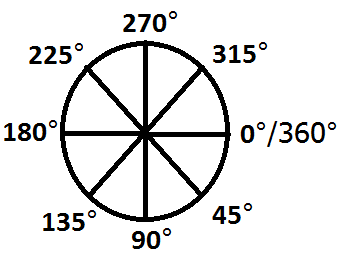
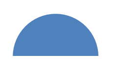

# OOXML SmartArt Pie Chart Construction

[King Salemno](https://social.msdn.microsoft.com/profile/King%20Salemno)
12/3/2010 2:07:00
PM

-----

# OOXML SmartArt Pie Chart Construction  

In
recent years, vector graphics have become much more preferable due to
the various display systems encountered. Thus, images could be resized
without fear of quality loss. SmartArt works in a similar fashion. To
illustrate this, I am going to show the construction of a basic pie
chart in Word 2010 as an
example.

*The
graphic displayed above is an example of a basic pie chart with 3
slices. All 3 slices shown are constructed via XML.*

To
fully understand the construction of a smartart pie chart, an
understanding of geometry is necessary. What do we know about a pie? It
represents a geometric shape which happens to be a circle. What do we
know about circles? How do we map a point on a circle? We can find
definitive points on a circle given a unit of angular measurement. There
are 2 widely used such measurements: radians and degrees. However, for
our purposes, we are going to use the degree measurement as this is the
measurement used by the current
standard.

**Note:
0° and 360° refer to the same
point.**

Illustrated
above is our reference circle to explain the basics of construction.
Think of this as a race. You have a starting point and an ending point.
Given 2 points of reference, you can calculate the length between both
points. This is how the slices of the pie are constructed. We provide a
starting point and ending point by using the degrees unit of
measurement. The direction of marking along the circular path is
clockwise with 0/360 being our reference point. Therefore, to create a
slice that is half of the circle (the top half); we provide the
numerical values 180 and 360. 180 will be our starting point with 360
being the end of the angle. 

The
following 2 graphics illustrate this slice measurement. The graphic on
the left shows the area of interest shaded, while the second shows the
slice that would appear in Word
2010:

These
values are contained in groups of two called ***shape adjust values***.
These values are sub-elements found underneath a serialized shape object
(XML Element: dgm:shape) and are identified by a shape adjust index
(idx), which uniquely identified the starting and ending points; with
the shape adjust index idx1 being the starting point and idx2 being the
ending
point.

Please
note that the information presented in this blog is not currently in the
\[MS-ODRAWXML\] Specification document but should be included in a
future release of the
documentation.

**References**

[\[MS-ODRAWXML\]:
Office Drawing Extensions to Office Open XML
Structure](http://msdn.microsoft.com/en-us/library/dd905216.aspx)

*Specifies
extensions to the DrawingML OOXML File Format Structure, which is used
in WordprocessingML, SpreadsheetML and PresentationML documents.*

[OOXML SmartArt Pie Chart
Construction.pdf](images/OOXML%20SmartArt%20Pie%20Chart%20Construction.pdf)

