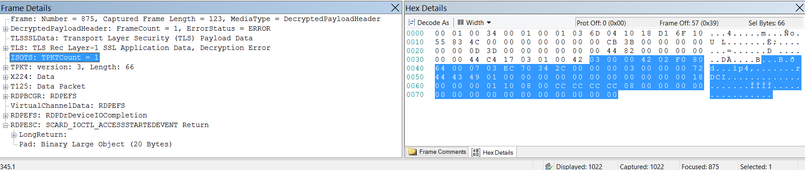
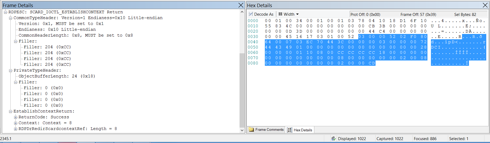

# RDPESC parser modification

[Sebastian
Canevari](https://social.msdn.microsoft.com/profile/Sebastian%20Canevari)
5/30/2013 12:30:00 PM

-----

Hello world\!

I’ve decided to write this entry to talk about two  
intertwined subjects:

\- The published RDPESC parser needs a little tweak  
in order to function properly

\- That tweak is a real life example of how to  
modify an existing Netmon Parser

My goal is not to rewrite the
[\[MS-RDPESC\]](http://msdn.microsoft.com/en-us/library/cc242596.aspx)  
document in this publication so I’ll be assuming that you are familiar
with it  
and will touch the protocol details just tangentially.

 

**Introduction**

I’ve recently worked on a case where a customer was  
observing that
[Netmon 3.4](http://www.microsoft.com/en-us/download/details.aspx?id=4865)  
was not being able to decode some of the RDPESC packets correctly. The
parser  
was only going as far as the TLS layer and was taking the rest of the
data as a  
simple Blob.

This is pretty much what it looked
like:

 

**Easy case**

The first thing that came to my mind was obviously that the  
parser version the customer was using was stale so, I provided the link
to the  
latest and greatest version of Netmon parsers:
[03.04.2978.0001](https://connect.microsoft.com/site216/Network%20Monitor%20Parsers).

 

**Hold your horses\!**

Although customer was happy with the way the newer version  
of the parsers was handling the RDPESC structures… there was something
not  
working…

This is what the same frame looked like with the plain  
vanilla new
parsers:

As we can see, this is day and night compared with not  
having anything parsed below TLS.

But… and there’s always a “but”, look at the RDPESC packet  
itself. There’s something wrong…

This is what other RDPESC packets look like (other control  
codes that
is):

**** 

**Don’t lose your headER\!\!\!**

Different calls and returns contain different data (duh\!)… Even  
different headers sometimes\! (hmmm)

But, shouldn’t packets ALWAYS have a header?\!?\!

(What? What red pill? Oh…. Ok… lots of water? Ok, here it  
goes…)

Sorry, my friend Morpheus was talking to me.

As I was saying, even though there might be protocols that  
do not have a properly design header structure, RDPESC is not one of
those and  
its packets do indeed possess a header.

So, what could possibly go wrong with the parser that it is  
treating one return call differently from another return call?

 

**Welcome to "The Parserix"…**

If we right click on the RDPESC call return and  
select “Go To Data Type Definition”, the RDPESC parser file opens up and
the  
first thing we can see is
this:

At first sight, having a “switch” clause is a good sign. It  
wouldn’t be the first time someone misses a case in a switch clause…
would it?

Although the above mentioned is a very common scenario, it  
was not the EXACT case this time around.

Because of the way the RDPESC parser works, we need to look  
at the initial call’s control code in order to figure out which of the  
scenarios it is that we are dealing with.

I present you with the control code for
SCARD\_IOCTL\_ACCESSSTARTEDEVENT:

Once the control code has been identified, we can then see  
that 0x900E0 is a special case on the RDPESC parser
world:

 

**All fine and dandy but, what’s wrong?**

Well, basically the document specifies in section 3.1.4  
that:

*“6. Otherwise,  
DR\_DEVICE\_IOCOMPLETION.IOStatus MUST be set to 0 (STATUS\_SUCCESS)
and  
DR\_DEVICE\_IOCOMPLETION.Parameters.DeviceIOControl.OutputBuffer MUST
contain an  
encoding of the structure (as specified in the preceding Message
Processing  
Events and Sequencing Rules IOCTL Table) as specified in*
[*\[MS-RPCE\]*](http://blogs.msdn.com/controlpanel/blogs/posteditor.aspx/%5bMS-RPCE%5d.pdf)
*section 2.2.6.
DR\_DEVICE\_IOCOMPLETION.Parameters.DeviceIOControl.OutputBufferLength  
is the length of the data.”*

That means that the return call is to be parsed WITH an  
MSRPCHeader.

So, we need to modify the parser.

 

 

**MUST… MODIFY… PARSER…  
**

So in order to make this change to the parser, we can follow  
either of the two main ways we know we can use to modify parsers:

\- We can either add a personalized copy of the  
parser to some “myparsers” folder and then set that folder as the first
option  
in the list of precedence in the current profile OR

\- We can replace the existing RDPESC parser from  
the Windows profile in Network Monitor with an updated version of it.

In this case, we’ll use the second approach.

These are the steps:

1\) Navigate to “C:\\ProgramData\\Microsoft\\Network  
Monitor 3\\NPL\\NetworkMonitor Parsers\\Windows”

2\) Save a copy of rdpesc.npl to a safe location

3\) Open the original file with a text editor

4\) Replace:

  
                              // SmartCardCall W/O MSRPCHeader

                              case 0x000900E0:

                                            
switch(property.RDPEFSPacketId)

                                             {

                                                            case
0x4952:

                                                                          
UINT32 Unused;

                                                            case
0x4943:

                                                                          
RDPESCLongReturn LongReturn;

                                             }  
  

5\) With:  
  
  
                              //

                              // SmartCardCall (Special case, see below)

                              //

                              case 0x000900E0:

                                            
switch(property.RDPEFSPacketId)

                                             {

                                                            case
0x4952:

                                                                          
//

                                                                          
//The "Call" does NOT have a
RPCHeader

                                                                          
//

                                                                          
UINT32 Unused;

                                                            case
0x4943:

                                                                          
//

                                                                          
// Whereas, the "Return" does (so, handle the same way as all the
other  
IOCTLs)

                                                                          
//

                                                                          
\_struct
RDPESCSmartCardCallWithMSRPCHeader

                                                                          
{

                                                                                         
RPCECommonTypeHeader
CommonTypeHeader;

                                                                                         
RPCEPrivateTypeHeader
PrivateTypeHeader;

                                                                                         
RDPESCLongReturn
LongReturn;

                                                                          
}

                                             }

 

6) Save the file back to its original place

 

Once the modification has been made, reopen the  
capture in Network Monitor and look at the results. The return call
should now  
look like
this:

 

**Conclusion**

“It is
done\!”

 

*PS:*
I was going to be more wordy for the conclusion of this entry but I
figured out that  
the post was pretty much self-explanatory.  
  
BTW, if you want to learn some more details regarding parser
modifications, you  
can take a peek at my co-worker’s entry from some time ago:
<http://blogs.msdn.com/b/openspecification/archive/2011/08/08/customizing-in-box-netmon-parsers-how-to-edit-and-deploy-updated-netmon-parsers.aspx>

 

