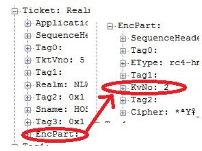

# To KVNO or not to KVNO, what is the version\!?

[Sebastian
Canevari](https://social.msdn.microsoft.com/profile/Sebastian%20Canevari)
11/13/2009 11:36:00
AM

-----

 

Shakespeare
knew nothing about Kerberos V5…
Nothing\!  

But, I still like
him\! And that, despite the fact that he had the audacity to paraphrase
me in his play “Hamlet”. Of course no one believes me\! 

I must admit it
would be much easier to convince you about this historic truth if I had
been born about \~400 years BEFORE him.

But, oh well…

What I CAN
probably convince you about is today’s topic… KVNO is not always as
decisive as it’s thought to be.

Aha\! I bet you
did not see THAT one
coming\!

First
things first: **“What does KVNO stand for?”**

KVNO stands for:
Key Version Number.

Ok,
good. Now: **“What key are we talking about?”**

Of course we are
talking about the Client’s Secret Key, what did you expect?

Each machine on
the network possesses a Long Term Key (Secret Key) that is used to
authenticate with the KDC in order to obtain tickets and to encrypt
those tickets when sending them within the
AP\_REQ.

Before
you ask: **“What’s an AP\_REQ?”**

The AP\_REQ is the
initial message that the client machine sends to the Server on the
network in order to request Kerberos authentication and gain access to a
specific Service on that Server. That service could be SMB, LDP or any
service that the server has registered with the KDC and has a
SPN.

Ok,
now we need to understand: **“What is the KVNO field
for?”**

The KVNO is a
field on the AP\_REQ that indicates what version of the key has been
used to encrypt the service ticket.

This is where the
KVNO is located when looking into the
AP\_REQ:

 

And, this is the
description of the KVNO found
in[
RFC4120](http://www.ietf.org/rfc/rfc4120.txt):

  
Key Version Number
(kvno)

     
A tag associated with encrypted data identifies which key was
used

     
for encryption when a long-lived key associated with a
principal

     
changes over time.  It is
used during the transition to a new
key

     
so that the party decrypting a message can tell whether the
data

     
was encrypted with the old or the new key.

 

Now, if there’s a
KVNO field, it is safe to assume that there could be different versions
of the key.

That
leads to the next question: **“When and how is the long term key
changed?”**

The key is
generated by an algorithm that derives it from the account
password.

With account I’m
referring to the Active Directory object that represents the client
computer. That account has a password just like any user account but,
the one big difference is that the password for this account is not
known or set by any user. Instead it’s by default automatically reset
every 30 days by the computer itself.

Now, as we stated
before, the key is derived from the password so… yes, you are right, the
key has to change every time that the password changes. As you might
have already figured out, the KVNO is incremented by 1 when this
happens.

The
big question now is: **“What would be a scenario where the key used to
encrypt the ticket is different from the one that the server has
stored?”**

Well, we can be
facing this scenario in the following
situation:

1)     
A
Client obtains a valid ticket from the KDC (this ticket is kept and used
until expired) and used the
KVNO=5

2)     
The
client then renews its password (if default, 30 days have passed since
last
reset)

3)     
KVNO
will increase to 6 and change is picked up by the target
server

4)     
Ticket
is still valid since it has not expired nor the machine has been
rebooted or the cache
purged

5)     
Machine
tries to access service on target server with ticket encrypted with
KVNO=5

This scenario is
fairly usual and it’s covered by the
[ RFC4120](http://www.ietf.org/rfc/rfc4120.txt)
as
    well:

    The ticket is decrypted using the version of the server's key specified by the ticket.  If the decryption routines detect a modification of the ticket (each encryption system MUST provide safeguards to detect modified ciphertext), the KRB_AP_ERR_BAD_INTEGRITY error is returned (chances are good that different keys were used to encrypt and decrypt).

 

I
bet you are thinking: **Ooohhhh\!\!\! So that’s when KVNO saves the day
right\!?**

Well, yes and
no.

Yes, it can be
used for that. No, Windows does not pay attention to
KVNO.

 It
simply ignores it. Like if KVNO wasn’t even present
(Editor’s Note:
Any similarities with the life of the author are pure
coincidence)

Windows server
will follow these
steps:

1)     
It
will try to decrypt the service ticket in the AP\_REQ with the current
key

2)     
If
it succeeds, it then sends the AP\_REP to the client and the process
moves
forward

3)     
But
if it fails, it will then make its best effort and try to decrypt the
ticket with the previous version of the key
(KVNO-1)

4)     
If
it succeeds, AP\_REP and process moves
forward

5)     
If
it fails, it will fail the AP\_REQ and send an AP\_REP with
 KRB\_AP\_ERR\_MODIFIED

I
can read your mind; I know you are eager to say: **I got it\! This is
very interesting information\! I should visit this blog more
often\!**

Well,
you will be even more surprised if I say to you: **But wait\! There’s
more\! If you read the next few lines in the next 30 seconds, you will
also receive a wonderful CAVEAT\!**

And you reached
this line so… here’s the caveat.

Not always,
Windows has the chance to store the previous key (KVNO-1) and make its
best effort to decrypt a ticket that was encrypted with an older
key.

That will depend
on a simple requirement:

In order for the
server to store the previous version of a key, the password change for
the computer account must have been done on that particular
server.

What I mean with
this is that the server that received the request and that processed the
password change, saves the old password and can use it as the KVNO-1
key. The rest of the servers, do not have a KVNO-1 available and will
fail the request with  AP\_REP
with  KRB\_AP\_ERR\_MODIFIED
after trying with the current key.

When the client
receives a  AP\_REP with
 KRB\_AP\_ERR\_MODIFIED, purges
its tickets cache and requests a new ticket to the KDC. This time, the
ticket will be encrypted with the current version of the key and the
exchange would
succeed.

**One
last juicy perk for having resisted your desire to close the browser and
run away from
me\!**

 A
script to change the computer password on demand and thus be able to
test all this details\!

Or did you think
that it was going to be as simple as right clicking somewhere?

Run this on the
domain controller where you want to change the account
password:

*Dim
objComputer*

*Set
objComputer =
GetObject("LDAP://CN=computername,CN=computers,DC=yourdomain,DC=yoursuffix")*

*objComputer.SetPassword
"P@ssw0rd1"*

*Wscript.Quit*

 

Hope you found
this information useful\!

Hasta
luego\!

 

