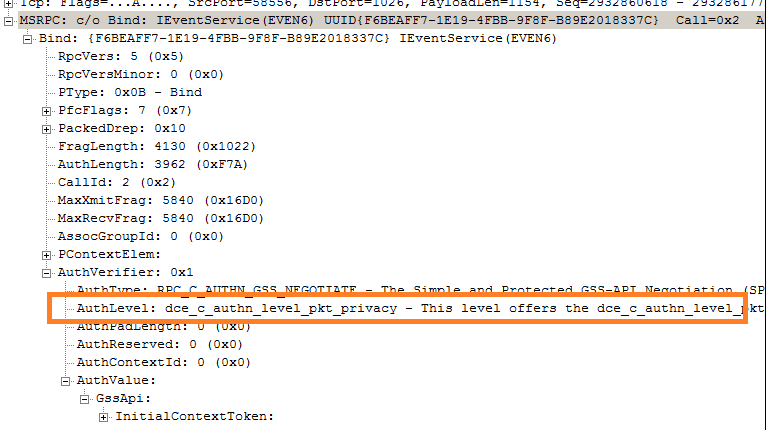
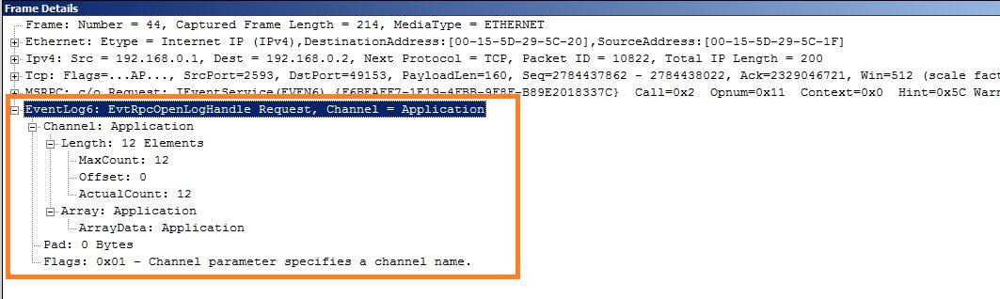
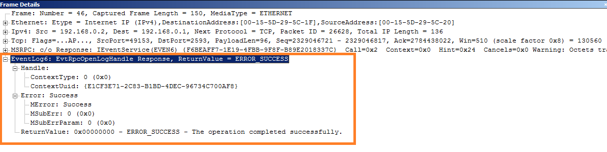

# Unencrypted MS-EVEN6 Traffic

[Tarun Chopra -
MSFT](https://social.msdn.microsoft.com/profile/Tarun%20Chopra%20-%20MSFT)
1/13/2013 8:59:00 PM

-----

**This blog entry is intended for readers interested in generating
unencrypted MS-EVEN6
(**[**http://msdn.microsoft.com/en-us/library/cc231282(v=PROT.13).aspx**](http://msdn.microsoft.com/en-us/library/cc231282\(v=PROT.13\).aspx)
**) protocol traffic.**

**NOTE: Questions and comments are welcome. However, please DO NOT post
a comment using the comment tool at the end of this post. Instead, post
a new thread in the Open Specifications Forum: Windows Protocols at**
[**http://social.msdn.microsoft.com/Forums/en-US/os\_windowsprotocols**](http://social.msdn.microsoft.com/Forums/en-US/os_windowsprotocols)**.**

 

**Can windows inbox tools be configured to generate unencrypted
traffic?**

No, Windows inbox tools eventviewer and wevtutil generates encrypted
MS-EVEN6 traffic and there is NO registry setting to alter this
behavior. These tools invokes RPC bind with authentication-level set to
RPC\_C\_AUTHN\_LEVEL\_PKT\_PRIVACY which ensures encrypting the argument
value of each remote procedure call. Refer below screenshot highlighting
authentication-level
field.

 

  
 **What does MS-EVEN6 specification say about authentication-level?**

MS-EVEN6 specification,
<http://msdn.microsoft.com/en-us/library/cc231303(v=prot.13)>, does not
impose any such constraint on authentication-level and we confirmed that
windows server does accept RPC bind with authentication-level set to
RPC\_C\_AUTHN\_LEVEL\_PKT\_INTEGRITY. Benefit of using
RPC\_C\_AUTHN\_LEVEL\_PKT\_INTEGRITY authentication-level over
RPC\_C\_AUTHN\_LEVEL\_PKT\_PRIVACY --- MS-EVEN6 traffic will be
unencrypted.

This is a **good news**
for the implementers interested in analyzing unencrypted EVEN6 packet.
But it requires some work as we have to write a custom client with
authentication-level set to RPC\_C\_AUTHN\_LEVEL\_PKT\_INTEGRITY during
RPC bind and then use that binding handle to invoke EVEN6 methods 

 

**A feasible option to generate unencrypted MS-EVEN6 traffic**

I recently wrote a sample application in C++ to generate unencrypted
protocol traffic and detail steps are as follows:

 

1\. Install visual studio 2008/2010 Ultimate/professional on a
development machine.

2\. Copy and paste the IDL given in EVEN6 \[MS\_EVEN6\] specification to
a notepad and save file as even6.idl

3\. Since it’s an RPC based protocol, copy and paste IDL given in
MS-RPCE specification to notepad and save file as ms-rpce.idl

4\. Place both the above files in same folder and use MIDL compiler to
generate stub and header files. For this, go to start, type “visual
studio”, launch “Visual Studio Command Prompt” and issue below command:

midl even6.idl

5\. Step 4 will generate even6.h, ms-rpce.h, even6\_c.c which you need
to include in your project. Choose VC++, Win32 console application as
project type.

6\. In the file that has “\_tmain” function, include header files and
create binding handle (IfHandle) that has to be passed to EVEN6 methods.
Following snippet shows how to create a binding handle:

 

int bindStatus, bStatStringBnd;

RPC\_BINDING\_HANDLE IfHandle = NULL;

RPC\_WSTR pszStringBinding;

TCHAR \*pszEven6UUID = TEXT("F6BEAFF7-1E19-4FBB-9F8F-B89E2018337C");

TCHAR \*pszEndpoint  = TEXT("");

TCHAR \*protoSeq = TEXT("ncacn\_ip\_tcp");

wchar\_t exceptionString\[512\];

ULONG\_PTR lpArguments = (ULONG\_PTR)exceptionString;

pszStringBinding = (RPC\_WSTR)MIDL\_user\_allocate(512);

bindStatus = RpcStringBindingCompose( (RPC\_WSTR)pszEven6UUID,
(RPC\_WSTR)protoSeq, (RPC\_WSTR)pszServer, NULL, NULL,
(RPC\_WSTR\*)\&pszStringBinding);

if (RPC\_S\_OK == bindStatus){ printf ("The call succeeded.
RpcStringBindingCompose\\n");

}

if (RPC\_S\_INVALID\_STRING\_UUID == bindStatus) {  sprintf((char
\*)exceptionString, "The string representation of the UUID: , %s , is
not valid.\\n", pszEven6UUID);

RaiseException( bindStatus, 0, 1, \&lpArguments );

}

bStatStringBnd = RpcBindingFromStringBinding(
(RPC\_WSTR)pszStringBinding, \&IfHandle);

bStatStringBnd = RpcBindingSetAuthInfo( IfHandle, (RPC\_WSTR)pszServer,
RPC\_C\_AUTHN\_LEVEL\_PKT\_INTEGRITY, RPC\_C\_AUTHN\_WINNT, NULL,
RPC\_C\_AUTHZ\_NAME);

 

7\. Pass this IfHandle to various EVEN6 calls, I tested
EvtRpcOpenLogHandle, and you should be able to generate unencrypted
traffic.

If (RPC\_S\_OK == bStatStringBnd) {

hEven6Binding = IfHandle;

RpcInfo error2;

error\_status\_t error = EvtRpcOpenLogHandle(L"Application", 1,
(PCONTEXT\_HANDLE\_LOG\_HANDLE\*)\&hEven6Binding, \&error2);

}

Bind Request Packet with authentication-level as
RPC\_C\_AUTHN\_LEVEL\_PKT\_INTEGRITY:

 

  
   
 Bind Response Packet with authentication-level as
RPC\_C\_AUTHN\_LEVEL\_PKT\_INTEGRITY:

 

  
   
 Unencrypted EvtRpcOpenLogHandle request
packet:

 

 

Unencrypted EvtRpcOpenLogHandle response
packet:

 

 

 

**References**:

Open Specifications Support Team Blog:
<http://blogs.msdn.com/b/openspecification/>  
  
Open Specifications Forums:
<http://blogs.msdn.com/b/openspecification/>  
  
Open Specifications Forum/Windows Protocols:
<http://social.msdn.microsoft.com/Forums/en-US/os_windowsprotocols/threads>

Network Monitor Blog: <http://blogs.technet.com/b/netmon/>

 

