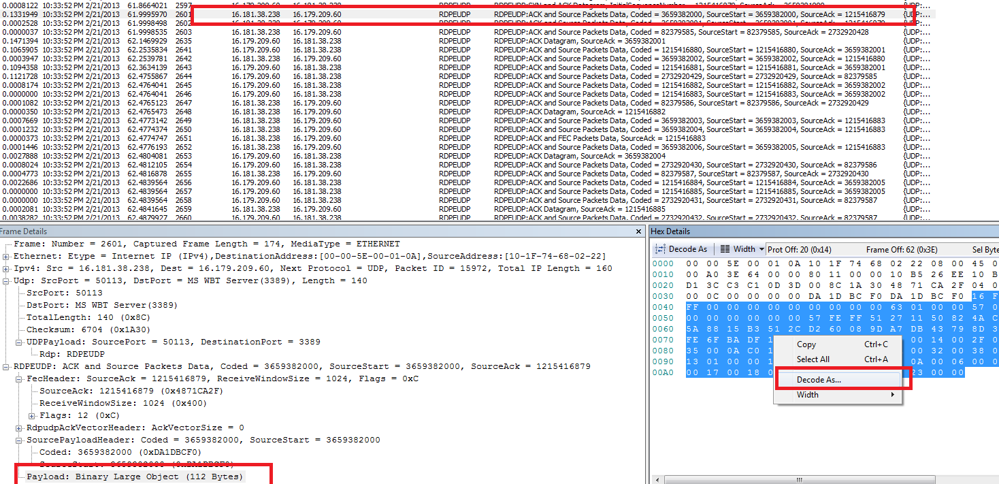
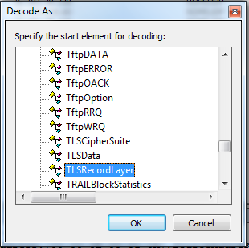
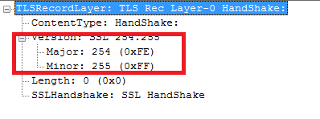
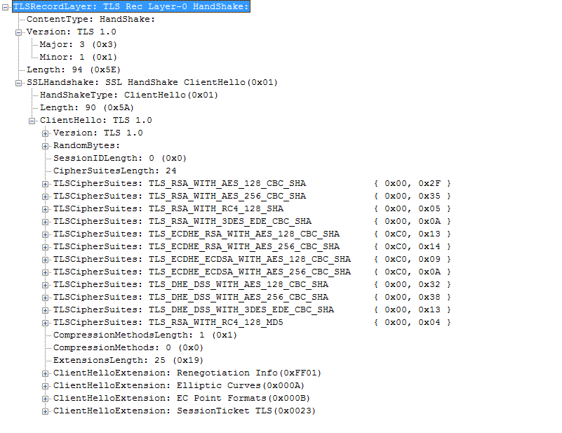

# \[MS-RDPEUDP\] : Glance at TLS/DTLS handshake packets.

[Tarun Chopra -
MSFT](https://social.msdn.microsoft.com/profile/Tarun%20Chopra%20-%20MSFT)
9/11/2013 1:45:00 PM

-----

MS-RDPEUDP is a new protocol in RDP8 and operates in 2 modes : Reliable
(RDP-UDP-R) and Best Efforts “Loss” (RDP-UDP-L). RDPEUDP is preferred by
default if both the endpoints are RDP8 capable, however, this can be
changed through Group policy (On the client side, we have Computer
Configuration, Administrative Templates, Windows Components, Remote
Desktop Services, Remote Desktop Connection Client: Turn off UDP On
Client.We don’t have a corresponding “Turn off TCP on Client”, so the
options are TCP only or TCP and UDP.  On the server-side, we have
Computer Configuration, Administrative Templates, Windows Components,
Remote Desktop Services, and Remote Desktop Session Host: Select RDP
Transport Protocols to “Use both UDP and TCP”, “Use only TCP” and “Use
Either TCP or UDP”.  ).

 

Furthermore, minencryption level
(<http://technet.microsoft.com/en-us/library/cc785662(v=ws.10).aspx> )
MUST be set to 3 (TS\_ENCRYPTION\_LEVEL\_HIGH) and securitylayer to 2
(TS\_SECURITY\_LAYER\_SSL) for RDPEUDP to flow and If it’s set to any
other value then RDPEUDP will not be used .In RDP7, if
minencryptionlevel is set to 1 then unencrypted RDP PDUs will flow from
server to client, but this will not work for RDPEUDP.

 

Flow of TLS/DTLS packets over UDP is bit different from traditional TLS
packets exchanged on TCP connection. Primary difference being, TLS\\DTLS
packets including session packets are enveloped within RDPEUDP header
which was not the case with TLS over TCP. Following is the related
excerpt from section 1.4 of MS-RDPEMT specification :

     **"The TLS or DTLS handshake, as well as the encrypted payload, are
embedded in the RDPUDP\_SOURCE\_PAYLOAD\_HEADER as defined in
\[MS-RDPEUDP\]."**

  
In this blog, with the help of screenshot, I will show packet layout of
TLS\\DTLS PDUs enveloped within RDPEUDP header.

1.  Capture network traffic between two windows 8 machines (for that
    reason any RDP8 supported machine) using Netmon and apply filter as
    ‘RDPEUDP’. Don’t apply ‘TLS’ filter as it will not show any
    RDPEUDP packets, reason being, ‘TLS’ packets are enveloped within
    RDPEUDP header.
2.  Only ‘**ACK and Source Packets Data**’
    (<http://msdn.microsoft.com/en-us/library/hh554288.aspx>) and ‘**ACK
    and FEC Packets Data**’
    (<http://msdn.microsoft.com/en-us/library/hh537287.aspx>) PDUs
    contain TLS\\DTLS data in ‘Payload’ and ’FEC payload data’ fields
    respectively. Presently, Netmon can’t parse these Payloads hence we
    can’t even see the unencrypted TLS\\DTLS session setup packets.
    Furthermore, Netmon doesn’t have DTLS parser hence we will be able
    to decode only TLS session packets.
3.  In order to view these session packets, select ‘RDPEUDP.Payload’
    field in first **ACK and Source Packets Data**’ PDU and right click
    on the highlighted ‘Hex Details’ and press ‘Decode As’ (Note : This
    just decodes the raw packet into relevant structure, it does not do
    any decryption). Select ‘Structs’ and search for ‘TLSRecordLayer’
    structure. Now a new dialog box will open up with decoded packet. If
    the Version.Major and Minor fields are 254 and 255 then it’s a DTLS
    packet and Netmon won’t be able to decode
it. 

  
 

 

[

 

 

[

 

4\.  If the ‘RDPEUDP.Payload’ field in first **ACK and Source Packets
Data**’ PDU has ‘’16 03 01” or “16 03 02” as starting bytes then it’s a
TLS (not DTLS) packet. Provided it’s a session setup packet, it can be
decoded as per instructions in
Step3.

 

[

5\. Likewise, we can decode remaining TLS session setup PDUs over UDP
for further analysis.

 

Hope this blog will help in understanding RDPEUDP flow.

Thanks. 

 

**For win7Sp1/Windows 2008R2Sp1 refer following articles
to install\\configure DTLS and RDP 8.**

<http://support.microsoft.com/kb/2574819>

<http://support.microsoft.com/kb/2592687>

**** 

**References:**

\[MS-RDPEUDP\] : <http://msdn.microsoft.com/en-us/library/hh536846.aspx>

\[MS-RDPEMT\] : <http://msdn.microsoft.com/en-us/library/hh554775.aspx>

